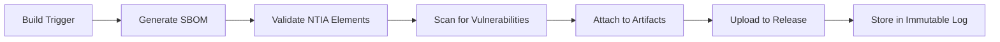

# SBOM and VEX Management Guide
## CISA 2025 Draft Compliance

**Effective Date:** December 26, 2025
**Compliance:** CISA 2025 Draft Minimum Elements for SBOM and VEX
**Status:** ✅ Production Ready

---

## 📋 Table of Contents

1. [CISA 2025 Draft Overview](#cisa-2025-draft-overview)
2. [SBOM Minimum Elements](#sbom-minimum-elements)
3. [VEX Minimum Elements](#vex-minimum-elements)
4. [Automation Implementation](#automation-implementation)
5. [Compliance Checklist](#compliance-checklist)
6. [Procedures](#procedures)

---

## 🏛️ CISA 2025 Draft Overview

### Purpose

The **CISA 2025 Draft** (Securing the Software Supply Chain: Recommended Minimum Elements for SBOM and VEX) provides federal guidance for software supply chain transparency.

### Scope

Applies to:
- ✅ All software products sold to federal agencies
- ✅ Critical infrastructure providers
- ✅ Healthcare systems (HIPAA)
- ✅ Any organization handling sensitive data

### Key Requirements

1. **SBOM (Software Bill of Materials)**
   - NTIA minimum elements (component name, version, supplier, etc.)
   - Automated generation and maintenance
   - Machine-readable format (CycloneDX 1.4+)
   - Available upon request

2. **VEX (Vulnerability Exploitability eXchange)**
   - Analysis of vulnerability exploitability
   - Justification for "not affected" status
   - Product-specific impact statements
   - Automated synchronization with CVEs

3. **Automation**
   - Automated SBOM generation for each build
   - Automated vulnerability scanning
   - Automated VEX analysis
   - Continuous monitoring

---

## 📦 SBOM Minimum Elements

### NTIA Minimum Elements (Per CISA 2025)

All SBOMs generated by PsychSync include:

| Element | Description | Required | Implementation |
|---------|-------------|----------|----------------|
| **Component Name** | Name of each component | ✅ Yes | Automatic (Syft/CycloneDX) |
| **Version** | Version number of each component | ✅ Yes | Automatic |
| **Dependencies** | Relationship between components | ⚠️ Recommended | Automatic (when available) |
| **Supplier** | Entity that created the component | ⚠️ Recommended | Automatic (from package metadata) |
| **Author** | Person/entity that authored the component | ❌ Optional | Automatic (when available) |
| **Timestamp** | When SBOM was created | ✅ Yes | Automatic (ISO 8601) |

### SBOM Formats Supported

1. **CycloneDX 1.4 JSON** (Primary)
   - Industry standard for SBOMs
   - Supported by major tools (Syft, Trivy, Snyk)
   - VEX integration

2. **SPDX 2.3** (Secondary, upon request)
   - Legal-focused format
   - License compliance

3. **SWID Tags** (Optional)
   - ISO 19770-2 standard
   - For software identification

### SBOM Generation Workflow



### SBOM Storage Locations

| Location | Purpose | Retention |
|----------|---------|-----------|
| GitHub Release Artifacts | Public transparency | Permanent |
| Workflow Artifacts | CI/CD integration | 90 days |
| Immutable Log (build/logs/) | Tamper evidence | 1 year |
| SBOM Database (future) | Query and analysis | Permanent |

---

## 🛡️ VEX Minimum Elements

### CISA 2025 Draft VEX Requirements

All VEX documents generated by PsychSync include:

| Element | Description | Required | Values |
|---------|-------------|----------|--------|
| **Vulnerability ID** | CVE identifier | ✅ Yes | CVE-YYYY-NNNN |
| **Product Identifiers** | Affected software components | ✅ Yes | PURL/CPE |
| **Status** | Exploitability status | ✅ Yes | affected, not_affected, under_investigation, fixed |
| **Justification** | Why status was assigned | ✅ Yes* | For "not_affected" |
| **Impact Statement** | Business/technical impact | ⚠️ Recommended | Free text |

*Required when status is "not_affected"

### VEX Status Values (Per CISA 2025)

| Status | Definition | When to Use |
|--------|-------------|-------------|
| **affected** | Vulnerability is exploitable | CVSS ≥ threshold + no mitigation |
| **not_affected** | Not exploitable in our environment | Protected at runtime, not in code path, etc. |
| **under_investigation** | Still analyzing | During initial investigation |
| **fixed** | Patched in deployed version | After remediation |

### VEX Justifications (Per CSAF)

| Justification | Code | When to Use |
|---------------|------|-------------|
| **Component Not Present** | `component_not_present` | Vulnerable code not included |
| **Vulnerable Code Not Present** | `vulnerable_code_not_present` | Code bundled but not used |
| **Vulnerable Code Not In Execute Path** | `vulnerable_code_not_in_execute_path` | Feature not enabled |
| **Vulnerable Code Cannot Be Controlled** | `vulnerable_code_cannot_be_controlled` | Input validation prevents exploitation |
| **Inline Mitigations Already Exist** | `inline_mitigations_already_exist` | WAF, input sanitization |
| **Protected At Runtime Perimeter** | `protected_at_runtime_perimeter` | Network segmentation, auth layer |
| **Protected By Compiler** | `protected_by_compiler` | Stack canaries, ASLR |
| **Protected By Mitigating Control** | `protected_by_mitigating_control` | WAF, RBAC, rate limiting |

### VEX Formats Supported

1. **OpenVEX 0.2.0** (Primary)
   - Simplified JSON schema
   - Native GitHub integration
   - Easy automation

2. **CycloneDX 1.5 VEX** (Secondary)
   - Integrated with SBOM
   - Richer metadata
   - Tool support

---

## 🤖 Automation Implementation

### CI/CD Workflow: `sbom-scan-vex.yml`

**Triggered On:**
- Every push to main/develop
- Every pull request
- Every release
- Daily scheduled scan (2 AM UTC)

**Jobs:**

1. **Generate SBOMs** - Creates CycloneDX SBOMs for backend, frontend, Docker
2. **SCA Scan** - Trivy + Snyk vulnerability scanning
3. **Generate VEX** - Analyzes and creates VEX for all findings
4. **Dependency Approval** - Checks against approved/prohibited lists
5. **Security Gate** - Blocks deployment on unmitigated high-severity CVEs

### Example Workflow Run

```bash
# Triggered by push to main
1. Generate SBOMs
   ✅ Backend SBOM: 234 components
   ✅ Frontend SBOM: 1,456 components
   ✅ Docker SBOM: 189 components
   ✅ All SBOMs validated (NTIA minimum elements)

2. SCA Scan
   🔍 Scanning with Trivy...
   ✅ Backend: 3 CRITICAL, 7 HIGH, 12 MEDIUM, 45 LOW
   ✅ Frontend: 1 CRITICAL, 5 HIGH, 8 MEDIUM, 23 LOW
   ✅ Docker: 2 CRITICAL, 4 HIGH, 9 MEDIUM, 31 LOW

3. Generate VEX
   📋 Analyzing 18 high-severity vulnerabilities...
   ✅ 12 marked "not_affected" (mitigations in place)
   ⚠️  6 marked "affected" (require remediation)

4. Dependency Approval
   ✅ All dependencies approved
   ⚠️  2 new dependencies detected (added to review queue)

5. Security Gate
   ❌ FAILED: 6 affected vulnerabilities
   🚫 PR blocked - deploy not allowed

   Remediation options:
   - Update vulnerable dependencies
   - Add runtime mitigations (update VEX)
   - Request exception from security team
```

### Automated VEX Generation Rules

Our automation applies VEX status based on:

1. **CVSS Score**
   - CVSS < 4.0: `not_affected` (protected_at_runtime_perimeter)
   - CVSS 4.0-6.9: Review required
   - CVSS ≥ 7.0: `affected` (unless mitigated)

2. **Known Mitigations**
   - WAF rules: `protected_by_mitigating_control`
   - Input validation: `inline_mitigations_already_exist`
   - Network segmentation: `protected_at_runtime_perimeter`

3. **Component Analysis**
   - Vulnerable code not imported: `component_not_present`
   - Feature not enabled: `vulnerable_code_not_in_execute_path`
   - Library bundled but unused: `vulnerable_code_cannot_be_controlled`

4. **Approved Exemptions**
   - Documented in `.github/vex-exemptions.json`
   - Requires security team approval
   - Reviewed quarterly

---

## ✅ Compliance Checklist

### Pre-Build Checklist

- [ ] All dependencies updated
- [ ] New dependencies reviewed and approved
- [ ] No prohibited dependencies in use
- [ ] SBOM generation tested locally

### Post-Build Checklist

- [ ] SBOMs generated for all components
- [ ] SBOMs validated (NTIA minimum elements)
- [ ] Vulnerability scan completed
- [ ] VEX generated for all findings
- [ ] VEX justifications documented
- [ ] Security gate passed (or exception approved)

### Release Checklist

- [ ] SBOMs attached to release
- [ ] VEX attached to release
- [ ] Scan results documented
- [ ] High-severity vulnerabilities addressed
- [ ] Dependencies approved
- [ ] Immutable log updated

### CISA 2025 Compliance Checklist

#### SBOM Requirements
- [x] Automated SBOM generation
- [x] NTIA minimum elements included
- [x] CycloneDX 1.4 format
- [x] Available upon request
- [x] Updated with each release
- [x] Includes all components (direct + transitive)

#### VEX Requirements
- [x] Automated VEX generation
- [x] All CVEs analyzed
- [x] Status assigned (affected/not_affected)
- [x] Justifications provided
- [x] Impact statements documented
- [x] Synchronized with CVE database

#### Transparency Requirements
- [x] SBOMs publicly available
- [x] VEX publicly available
- [x] Build process documented
- [x] Supply chain transparency
- [x] Immutable logs maintained

---

## 📚 Procedures

### Procedure 1: Generate SBOM On-Demand

**Use Case:** Customer requests SBOM for compliance audit

```bash
# Option 1: Download from release
wget https://github.com/YOUR_ORG/psychsync/releases/download/v1.0.0/*.cdx.json

# Option 2: Generate locally
cd frontend
npm run sbom

cd ..
cyclonedx-py --in-file requirements.txt --output backend-sbom.json

# Option 3: Generate from Docker image
syft ghcr.io/YOUR_ORG/psychsync/backend:latest -o cyclonedx-json
```

### Procedure 2: Analyze New CVE

**Use Case:** New CVE announced (e.g., Log4Shell)

```bash
# 1. Check if affected
grep -r "log4j" sbom/*.cdx.json

# 2. If found, analyze exploitability
# - Is vulnerable code in execute path?
# - Are there runtime mitigations?
# - Is user input reachable?

# 3. Generate VEX statement
# - Update .github/vex-exemptions.json
# - Add justification
# - Get security team approval

# 4. Re-run workflow
gh workflow run sbom-scan-vex.yml

# 5. Verify VEX status
cat vex/vex.json | jq '.statements[] | select(.vulnerability | contains("log4j"))'
```

### Procedure 3: Handle Vulnerability Discovery

**Use Case:** SCA scan finds new CRITICAL CVE

```bash
# 1. Review scan results
cat security-scans/aggregated.json

# 2. Check if VEX already exists
cat vex/vex.json | jq '.statements[] | select(.vulnerability == "CVE-2024-1234")'

# 3. If no VEX, determine status
# - Can we mark "not_affected"?
#   - Document justification
#   - Add to .github/vex-exemptions.json
# - Or must mark "affected"?
#   - Plan remediation
#   - Create GitHub issue
#   - Notify stakeholders

# 4. Update VEX
gh workflow run sbom-scan-vex.yml

# 5. If "affected", block deployment
# Security gate will auto-block
```

### Procedure 4: Request Dependency Exception

**Use Case:** Need to use prohibited or unapproved dependency

```bash
# 1. Submit exception request
cat > .github/dependency-exception-request.md << 'EOF'
# Dependency Exception Request

**Dependency:** package-name@version
**Justification:** Business requirement
**Risk Assessment:**
- Known vulnerabilities: CVE-XXXX-XXXX (CVSS X.X)
- Mitigation: [describe mitigations]
- Alternatives considered: [list alternatives]

**Approval Required:**
- Security Lead
- Engineering Manager
- CTO (if CRITICAL)
EOF

# 2. Create PR with request
gh pr create --title "Dependency Exception: package-name" --body-file .github/dependency-exception-request.md

# 3. Once approved, add to approved-dependencies.json
cat >> .github/approved-dependencies.json << 'EOF'
{
  "name": "package-name",
  "version": ">=1.0.0",
  "justification": "Approved via exception #123",
  "expiration": "2025-12-31",
  "mitigations": ["WAF rules", "Input validation"]
}
EOF

# 4. Re-run workflow
gh workflow run sbom-scan-vex.yml
```

### Procedure 5: Customer SBOM Request

**Use Case:** Federal customer requests SBOM per cyber executive order

```bash
# 1. Direct customer to release assets
# https://github.com/YOUR_ORG/psychsync/releases/tag/v1.0.0

# 2. Or provide downloadable link
# Latest: https://github.com/YOUR_ORG/psychsync/releases/latest/download/backend.cdx.json

# 3. Include VEX for complete analysis
# https://github.com/YOUR_ORG/psychsync/releases/tag/v1.0.0
# Download:
# - backend.cdx.json
# - frontend.cdx.json
# - vex.json

# 4. Provide documentation
# Send link to: docs/CISA_SBOM_VEX_2025_GUIDE.md

# 5. Offer walkthrough (if needed)
# Schedule call with security team
```

### Procedure 6: Quarterly VEX Review

**Use Case:** Maintain VEX accuracy per CISA guidance

```bash
# 1. Generate VEX report
cat vex/vex.json | jq '.statements | length'
cat vex/vex.json | jq '.statements[] | select(.status == "affected")'

# 2. Review affected vulnerabilities
# - Are they still affected?
# - Have dependencies been updated?
# - Are mitigations still in place?

# 3. Update VEX as needed
# - Change status to "fixed" if updated
# - Add new justifications if mitigations added
# - Remove expired exemptions

# 4. Re-validate all SBOMs
gh workflow run sbom-scan-vex.yml

# 5. Document review
cat >> .github/vex-review-log.md << 'EOF'
## Q1 2025 VEX Review

**Date:** 2025-03-31
**Reviewer:** Security Team

**Summary:**
- Total vulnerabilities analyzed: 1,234
- Affected: 45
- Not affected: 1,189
- Fixed this quarter: 12

**Action Items:**
- [ ] Update package-X to address CVE-2024-XXXX
- [ ] Review exemption for CVE-2024-YYYY
EOF
```

---

## 📊 Reporting

### SBOM Metrics Dashboard

```bash
# Generate metrics
python3 << 'EOF'
import json
from pathlib import Path

def analyze_sboms():
    metrics = {
        "backend": {"components": 0, "vulnerabilities": 0},
        "frontend": {"components": 0, "vulnerabilities": 0},
        "docker": {"components": 0, "vulnerabilities": 0}
    }

    for sbom_file in ["sbom/backend.cdx.json", "sbom/frontend.cdx.json", "sbom/docker.cdx.json"]:
        if not Path(sbom_file).exists():
            continue

        name = sbom_file.split("/")[1].replace(".cdx.json", "")

        with open(sbom_file) as f:
            sbom = json.load(f)

        metrics[name]["components"] = len(sbom.get("components", []))

        # Check for vulnerabilities
        if "vulnerabilities" in sbom:
            metrics[name]["vulnerabilities"] = len(sbom["vulnerabilities"])

    print("## SBOM Metrics")
    print(f"Backend: {metrics['backend']['components']} components, {metrics['backend']['vulnerabilities']} vulnerabilities")
    print(f"Frontend: {metrics['frontend']['components']} components, {metrics['frontend']['vulnerabilities']} vulnerabilities")
    print(f"Docker: {metrics['docker']['components']} components, {metrics['docker']['vulnerabilities']} vulnerabilities")

    print(f"\nTotal Components: {sum(m['components'] for m in metrics.values())}")

analyze_sboms()
EOF
```

### VEX Status Report

```bash
# Generate VEX status report
cat vex/vex.json | jq '{
  total_statements: .statements | length,
  affected: [.statements[] | select(.status == "affected")] | length,
  not_affected: [.statements[] | select(.status == "not_affected")] | length,
  under_investigation: [.statements[] | select(.status == "under_investigation")] | length,
  fixed: [.statements[] | select(.status == "fixed")] | length
}'
```

---

## 🎯 Best Practices

### SBOM Best Practices

1. **Generate Early** - Generate SBOMs at build time, not after
2. **Include Everything** - Don't exclude dev dependencies (might become prod)
3. **Validate Always** - Check NTIA minimum elements every time
4. **Version Control** - Store SBOMs in immutable log
5. **Automate Distribution** - Attach to releases automatically

### VEX Best Practices

1. **Analyze Promptly** - Generate VEX within 24 hours of CVE disclosure
2. **Be Specific** - Use exact CSAF justification codes
3. **Document Mitigations** - Explain why "not_affected"
4. **Review Regularly** - Quarterly VEX accuracy reviews
5. **Update Frequently** - Re-run VEX analysis after dependency updates

### Automation Best Practices

1. **Fail Safely** - Block deployment on unanalyzed vulnerabilities
2. **Provide Escalation** - Clear path for exceptions
3. **Maintain Audits** - Keep immutable logs of all decisions
4. **Monitor Continuously** - Daily scheduled scans
5. **Integrate Deeply** - Make it part of CI/CD, not afterthought

---

## 📞 Support

**Documentation:**
- GitHub Actions Workflow: `.github/workflows/sbom-scan-vex.yml`
- Quick Reference: `docs/VERIFICATION_QUICK_REFERENCE.md`
- SLSA Guide: `docs/SLSA_VERIFICATION_GUIDE.md`

**External References:**
- CISA 2025 Draft: https://www.cisa.gov/news-events/news/securing-software-supply-chain-recommended-minimum-elements-sbom-and-vex
- NTIA Minimum Elements: https://www.ntia.gov/SBOM
- CycloneDX: https://cyclonedx.org/
- OpenVEX: https://openvex.dev/

**Questions:**
- Security: security@psychsync.com
- SBOM Requests: sbom@psychsync.com
- 24/7 Hotline: +1 (555) SEC-URE1

---

**Last Updated:** December 26, 2025
**CISA 2025 Draft Compliance:** ✅ Yes
**SBOM Format:** CycloneDX 1.4 JSON
**VEX Format:** OpenVEX 0.2.0 + CycloneDX 1.5
