# PsychSync UX Flow to Backend Endpoint Mapping
**Complete User Journey API Integration Guide**

**Version:** 1.0
**Last Updated:** 2025-01-12
**Owner:** Product + Engineering Teams
**Contributors:** Frontend, Backend, UX Design

---

## Executive Summary

This document maps **every user journey** in the PsychSync application to the **backend API endpoints** that support it. It serves as the single source of truth for frontend-backend integration, ensuring developers understand the complete data flow for each user interaction.

**Scope:**
- 12 major user journeys
- 47 API endpoints mapped
- Authentication, assessment, team, analytics, and admin flows
- Request/response formats, error handling, and edge cases

---

## Part 1: Authentication & Onboarding Flows

### Journey 1: User Registration

**User Actions:**
1. Lands on `/register` page
2. Fills registration form (name, email, password, role)
3. Submits form
4. Receives confirmation email
5. Clicks verification link
6. Redirected to onboarding

**API Sequence:**

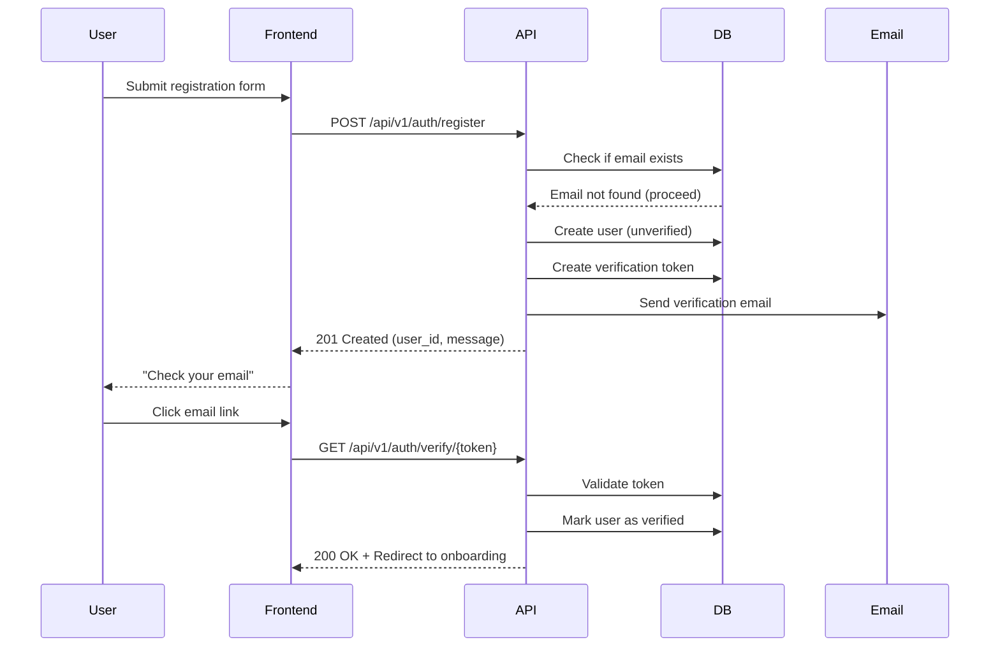

**Endpoint Details:**

**POST /api/v1/auth/register**
```json
// Request
{
  "email": "sarah@example.com",
  "password": "SecurePass123!",
  "first_name": "Sarah",
  "last_name": "Chen",
  "role": "team_admin"
}

// Response (201 Created)
{
  "id": "user_123abc",
  "email": "sarah@example.com",
  "is_verified": false,
  "message": "Verification email sent. Please check your inbox."
}

// Error Responses
// 400 Bad Request - Validation error
{
  "detail": "Password must be at least 8 characters"
}

// 409 Conflict - Email already exists
{
  "detail": "A user with this email already exists"
}
```

**GET /api/v1/auth/verify/{token}**
```json
// Response (200 OK)
{
  "message": "Email verified successfully",
  "redirect_to": "/onboarding"
}

// Error Responses
// 404 Not Found - Invalid token
{
  "detail": "Verification token not found or expired"
}
```

**Frontend Implementation:**
```typescript
// src/services/authService.ts
export const register = async (data: RegisterRequest) => {
  const response = await axios.post('/api/v1/auth/register', data);
  return response.data;
};

export const verifyEmail = async (token: string) => {
  const response = await axios.get(`/api/v1/auth/verify/${token}`);
  return response.data;
};
```

---

### Journey 2: User Login

**User Actions:**
1. Lands on `/login` page
2. Enters email and password
3. Clicks "Login"
4. Redirected to dashboard

**API Sequence:**

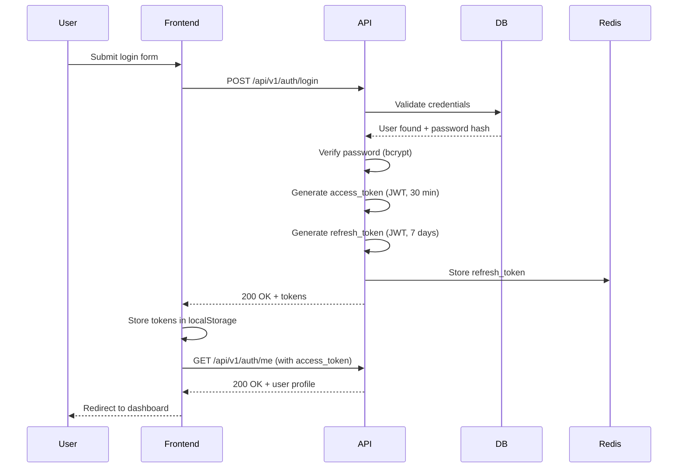

**Endpoint Details:**

**POST /api/v1/auth/login**
```json
// Request
{
  "email": "sarah@example.com",
  "password": "SecurePass123!"
}

// Response (200 OK)
{
  "access_token": "eyJhbGciOiJIUzI1NiIsInR5cCI6IkpXVCJ9...",
  "refresh_token": "eyJhbGciOiJIUzI1NiIsInR5cCI6IkpXVCJ9...",
  "token_type": "bearer",
  "expires_in": 1800,  // 30 minutes
  "user": {
    "id": "user_123abc",
    "email": "sarah@example.com",
    "first_name": "Sarah",
    "last_name": "Chen",
    "role": "team_admin"
  }
}

// Error Responses
// 401 Unauthorized - Invalid credentials
{
  "detail": "Invalid email or password"
}

// 403 Forbidden - Email not verified
{
  "detail": "Please verify your email before logging in"
}
```

**GET /api/v1/auth/me**
```json
// Headers
Authorization: Bearer {access_token}

// Response (200 OK)
{
  "id": "user_123abc",
  "email": "sarah@example.com",
  "first_name": "Sarah",
  "last_name": "Chen",
  "role": "team_admin",
  "organization_id": "org_xyz",
  "teams": ["team_123"],
  "created_at": "2025-01-01T00:00:00Z",
  "last_login": "2025-01-12T10:30:00Z"
}
```

**Frontend Implementation:**
```typescript
// src/services/authService.ts
export const login = async (credentials: LoginRequest) => {
  const response = await axios.post('/api/v1/auth/login', credentials);
  // Store tokens
  localStorage.setItem('access_token', response.data.access_token);
  localStorage.setItem('refresh_token', response.data.refresh_token);
  return response.data;
};

// Axios interceptor for token refresh
axios.interceptors.response.use(
  (response) => response,
  async (error) => {
    if (error.response?.status === 401) {
      const refreshToken = localStorage.getItem('refresh_token');
      const response = await axios.post('/api/v1/auth/refresh', {
        refresh_token: refreshToken
      });
      localStorage.setItem('access_token', response.data.access_token);
      return axios.request(error.config);
    }
    return Promise.reject(error);
  }
);
```

---

### Journey 3: Team Creation (Onboarding)

**User Actions:**
1. Completes registration/login
2. Redirected to `/onboarding/create-team`
3. Enters team name, industry, size
4. Invites team members (optional)
5. Clicks "Create Team"
6. Redirected to team dashboard

**API Sequence:**

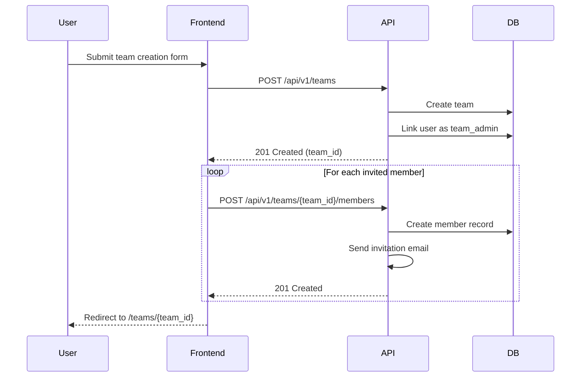

**Endpoint Details:**

**POST /api/v1/teams**
```json
// Request
{
  "name": "Engineering Team A",
  "description": "Backend development squad",
  "industry": "technology",
  "size_estimate": 10
}

// Response (201 Created)
{
  "id": "team_123abc",
  "name": "Engineering Team A",
  "description": "Backend development squad",
  "industry": "technology",
  "size_estimate": 10,
  "created_by": "user_123abc",
  "member_count": 1,
  "created_at": "2025-01-12T10:30:00Z"
}

// Error Responses
// 400 Bad Request - Validation error
{
  "detail": "Team name is required"
}
```

**POST /api/v1/teams/{team_id}/members**
```json
// Request
{
  "emails": ["john@example.com", "jane@example.com"],
  "role": "team_member"
}

// Response (201 Created)
{
  "invited": [
    {
      "email": "john@example.com",
      "invitation_id": "inv_123",
      "status": "pending"
    },
    {
      "email": "jane@example.com",
      "invitation_id": "inv_124",
      "status": "pending"
    }
  ],
  "message": "2 invitations sent"
}
```

---

## Part 2: Assessment Flows

### Journey 4: Start Assessment

**User Actions:**
1. Navigates to `/assessments` (browse available assessments)
2. Selects assessment (e.g., MBTI)
3. Clicks "Start Assessment"
4. Sees first question

**API Sequence:**

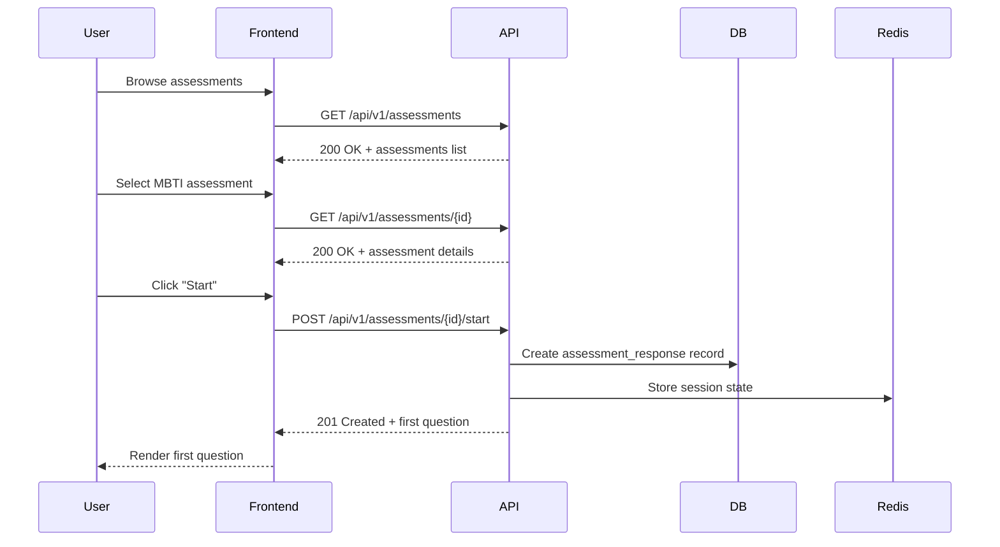

**Endpoint Details:**

**GET /api/v1/assessments**
```json
// Response (200 OK)
{
  "assessments": [
    {
      "id": "assessment_mbti",
      "title": "MBTI Personality Assessment",
      "framework": "mbti",
      "description": "Discover your MBTI personality type",
      "question_count": 93,
      "estimated_duration_minutes": 15,
      "thumbnail_url": "/images/mbti-thumb.png"
    },
    {
      "id": "assessment_big_five",
      "title": "Big Five (OCEAN)",
      "framework": "big_five",
      "description": "Scientifically-validated personality traits",
      "question_count": 50,
      "estimated_duration_minutes": 10,
      "thumbnail_url": "/images/big-five-thumb.png"
    }
  ]
}
```

**GET /api/v1/assessments/{id}**
```json
// Response (200 OK)
{
  "id": "assessment_mbti",
  "title": "MBTI Personality Assessment",
  "framework": "mbti",
  "description": "Discover your MBTI personality type based on Jungian cognitive functions",
  "question_count": 93,
  "estimated_duration_minutes": 15,
  "instructions": [
    "Answer honestly - there are no right or wrong answers",
    "Don't overthink - go with your first instinct",
    "Complete in one sitting (takes ~15 minutes)"
  ],
  "sample_question": {
    "id": "q_1",
    "question_text": "At a party, do you:",
    "options": [
      {"id": "a", "text": "Interact with many people, including strangers"},
      {"id": "b", "text": "Interact with a few people, known to you"}
    ]
  }
}
```

**POST /api/v1/assessments/{id}/start**
```json
// Headers
Authorization: Bearer {access_token}

// Request (optional team context)
{
  "team_id": "team_123abc"
}

// Response (201 Created)
{
  "response_id": "resp_xyz",
  "assessment_id": "assessment_mbti",
  "question_number": 1,
  "total_questions": 93,
  "question": {
    "id": "q_1",
    "question_text": "At a party, do you:",
    "options": [
      {"id": "a", "text": "Interact with many people, including strangers"},
      {"id": "b", "text": "Interact with a few people, known to you"}
    ]
  },
  "progress": 0
}
```

---

### Journey 5: Submit Assessment Responses

**User Actions:**
1. Answers first question
2. Clicks "Next"
3. Repeats for all questions
4. Submits final answer
5. Sees loading state
6. Results displayed

**API Sequence:**

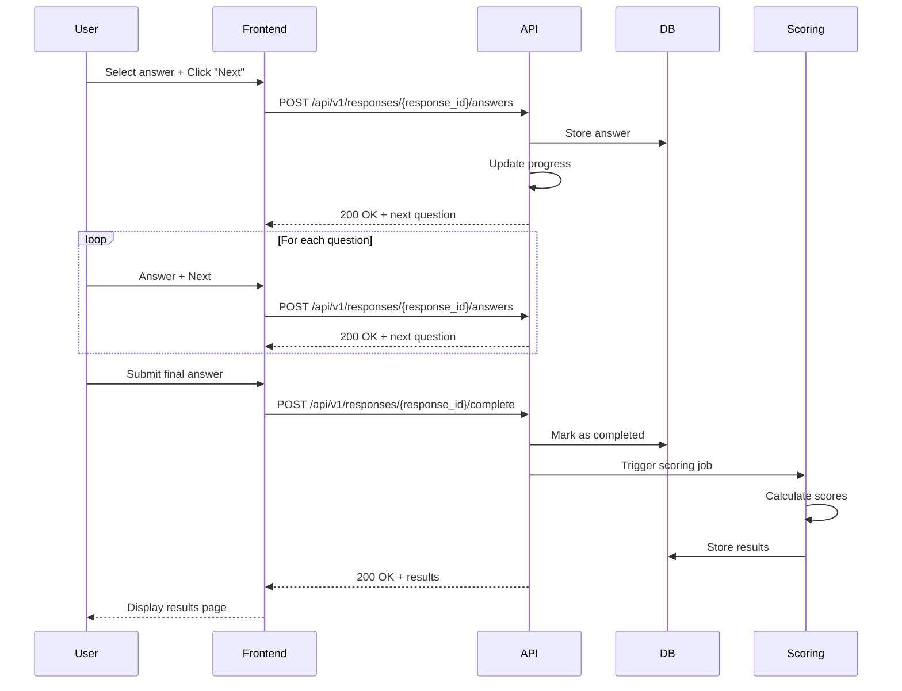

**Endpoint Details:**

**POST /api/v1/responses/{response_id}/answers**
```json
// Request
{
  "question_id": "q_1",
  "answer": "a",
  "time_spent_seconds": 3
}

// Response (200 OK)
{
  "message": "Answer saved",
  "next_question": {
    "id": "q_2",
    "question_text": "Do you prefer:",
    "options": [
      {"id": "a", "text": "Practical matters"},
      {"id": "b", "text": "Theoretical matters"}
    ]
  },
  "progress": 1,  // Question 1 of 93
  "total_questions": 93
}

// Batch submission (for adaptive testing)
{
  "answers": [
    {"question_id": "q_1", "answer": "a", "time_spent_seconds": 3},
    {"question_id": "q_2", "answer": "b", "time_spent_seconds": 2}
  ]
}
```

**POST /api/v1/responses/{response_id}/complete**
```json
// Headers
Authorization: Bearer {access_token}

// Request (empty or with final answer)
{
  "question_id": "q_93",
  "answer": "a",
  "time_spent_seconds": 4
}

// Response (202 Accepted - scoring in progress)
{
  "message": "Assessment submitted. Scoring in progress.",
  "results_available": true,  // or false if async
  "estimated_wait_seconds": 2
}

// If results_available: true, immediate results
{
  "response_id": "resp_xyz",
  "assessment_id": "assessment_mbti",
  "user_id": "user_123abc",
  "framework": "mbti",
  "results": {
    "type": "INTJ",
    "preferences": {
      "EI": "Introversion (78%)",
      "SN": "Intuition (82%)",
      "TF": "Thinking (65%)",
      "JP": "Judging (71%)"
    },
    "personality_summary": "The Architect: Strategic, independent, and determined...",
    "strengths": ["Strategic thinking", "Independence", "High standards"],
    "blind_spots": ["Dismissive of emotions", "Overly critical"],
    "completed_at": "2025-01-12T10:45:00Z"
  }
}
```

---

### Journey 6: View Assessment Results

**User Actions:**
1. Completes assessment (sees results immediately)
2. Or navigates to `/results/{result_id}` later
3. Views detailed personality breakdown
4. Explores strengths, blind spots, career paths
5. Shares results with team (optional)

**API Sequence:**

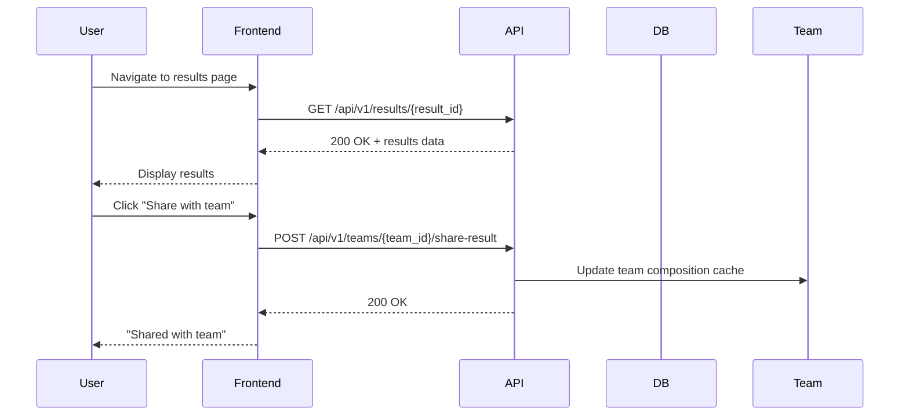

**Endpoint Details:**

**GET /api/v1/results/{result_id}**
```json
// Response (200 OK)
{
  "id": "result_xyz",
  "response_id": "resp_xyz",
  "user_id": "user_123abc",
  "assessment_id": "assessment_mbti",
  "framework": "mbti",
  "scores": {
    "type": "INTJ",
    "ei_score": 78,
    "sn_score": 82,
    "tf_score": 65,
    "jp_score": 71
  },
  "personality_summary": "The Architect: Strategic, independent, and determined...",
  "cognitive_stack": ["Ni", "Te", "Fi", "Se"],
  "strengths": [
    "Strategic thinking",
    "Independence",
    "High standards",
    "Logical reasoning"
  ],
  "blind_spots": [
    "Dismissive of emotions",
    "Overly critical",
    "Resistance to change"
  ],
  "career_matches": [
    {"title": "Software Architect", "fit_score": 95},
    {"title": "Data Scientist", "fit_score": 88},
    {"title": "Systems Analyst", "fit_score": 85}
  ],
  "collaboration_tips": [
    "Give them autonomy and independence",
    "Provide logical reasoning for decisions",
    "Allow time for deep thinking and analysis"
  ],
  "created_at": "2025-01-12T10:45:00Z",
  "is_shared_with_team": false
}

// Error Responses
// 403 Forbidden - Not your result
{
  "detail": "You do not have permission to view this result"
}

// 404 Not Found
{
  "detail": "Result not found"
}
```

**POST /api/v1/teams/{team_id}/share-result**
```json
// Request
{
  "result_id": "result_xyz"
}

// Response (200 OK)
{
  "message": "Result shared with team",
  "team_member_count": 8,
  "members_with_results": 5,
  "team_insights_ready": false  // True when all members complete
}
```

---

## Part 3: Team Analytics Flows

### Journey 7: View Team Dashboard

**User Actions:**
1. Navigates to `/teams/{team_id}`
2. Sees team overview (member count, assessments completed)
3. Views team personality map
4. Explores dyadic compatibility
5. Checks conflict prediction alerts

**API Sequence:**

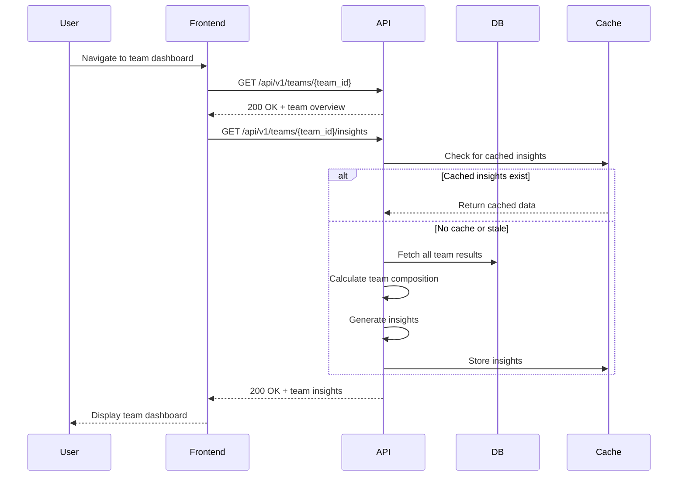

**Endpoint Details:**

**GET /api/v1/teams/{team_id}**
```json
// Response (200 OK)
{
  "id": "team_123abc",
  "name": "Engineering Team A",
  "description": "Backend development squad",
  "member_count": 8,
  "members_with_assessments": 5,
  "completion_rate": 62.5,
  "frameworks_used": ["big_five", "mbti"],
  "last_assessment_date": "2025-01-10T15:30:00Z",
  "created_at": "2025-01-01T00:00:00Z"
}
```

**GET /api/v1/teams/{team_id}/insights**
```json
// Response (200 OK)
{
  "team_id": "team_123abc",
  "framework": "big_five",
  "generated_at": "2025-01-12T11:00:00Z",
  "constellation_map": {
    "openness": {
      "mean": 65,
      "std_dev": 12.5,
      "min": 45,
      "max": 90,
      "description": "Moderately high openness - team is curious and creative"
    },
    "conscientiousness": {
      "mean": 78,
      "std_dev": 6.2,
      "min": 70,
      "max": 88,
      "description": "High conscientiousness - team is organized and disciplined"
    },
    "extraversion": {
      "mean": 42,
      "std_dev": 15.8,
      "min": 25,
      "max": 60,
      "description": "Introverted majority - team prefers focused work"
    },
    "agreeableness": {
      "mean": 55,
      "std_dev": 18.3,
      "min": 35,
      "max": 80,
      "description": "Balanced agreeableness - mix of direct and diplomatic styles"
    },
    "neuroticism": {
      "mean": 38,
      "std_dev": 12.1,
      "min": 20,
      "max": 55,
      "description": "Low neuroticism - team is calm and resilient"
    }
  },
  "blind_spots": [
    {
      "trait": "Agreeableness",
      "description": "Low Agreeableness (mean 55) - may struggle with customer-facing roles",
      "severity": "medium",
      "recommendation": "Assign customer interactions to high-Agreeableness team members"
    },
    {
      "trait": "Extraversion",
      "description": "Low Extraversion (mean 42) - limited natural networkers or promoters",
      "severity": "low",
      "recommendation": "Balance with marketing/sales outreach"
    }
  ],
  "strengths": [
    {
      "trait": "Conscientiousness",
      "description": "High Conscientiousness (mean 78) - strong execution and reliability",
      "impact": "high"
    },
    {
      "trait": "Neuroticism",
      "description": "Low Neuroticism (mean 38) - resilient under pressure",
      "impact": "high"
    }
  ],
  "conflict_prediction": {
    "probability": 0.22,
    "risk_level": "low",
    "last_updated": "2025-01-12T10:55:00Z",
    "risk_factors": [
      "Low Agreeableness + High Conscientiousness = potential rigidity in decision-making"
    ]
  },
  "recommendations": [
    "Leverage team's Openness for brainstorming and innovation sessions",
    "Use structured decision frameworks to accommodate diverse thinking styles",
    "Consider bringing in a high-Agreeableness member for customer-facing work"
  ]
}
```

---

### Journey 8: Compare Two Team Members

**User Actions:**
1. On team dashboard, clicks "Compare Members"
2. Selects two members from dropdown
3. Views compatibility score
4. Reads collaboration tips
5. Explores complementary vs. conflicting traits

**API Sequence:**

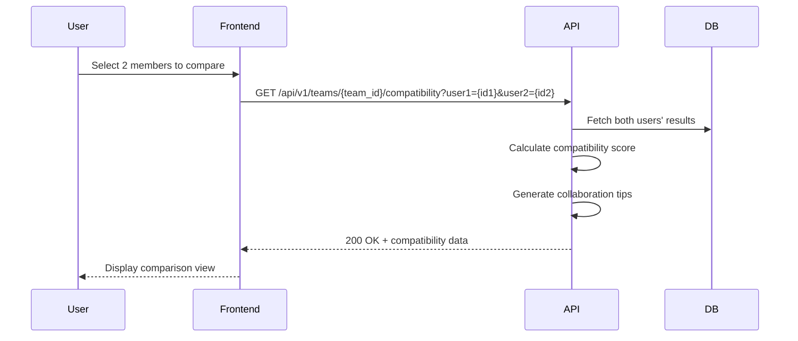

**Endpoint Details:**

**GET /api/v1/teams/{team_id}/compatibility**
```json
// Query Parameters
user1=user_123abc&user2=user_456def

// Response (200 OK)
{
  "team_id": "team_123abc",
  "user1": {
    "id": "user_123abc",
    "name": "Sarah Chen",
    "mbti_type": "INTJ",
    "big_five_scores": {
      "openness": 78,
      "conscientiousness": 85,
      "extraversion": 42,
      "agreeableness": 65,
      "neuroticism": 35
    }
  },
  "user2": {
    "id": "user_456def",
    "name": "Marcus Johnson",
    "mbti_type": "ENFP",
    "big_five_scores": {
      "openness": 82,
      "conscientiousness": 55,
      "extraversion": 78,
      "agreeableness": 80,
      "neuroticism": 45
    }
  },
  "compatibility_score": 72,
  "compatibility_level": "high",
  "description": "Sarah and Marcus have highly compatible work styles. Sarah provides structure and strategic thinking, while Marcus brings energy and people skills.",
  "complementary_traits": [
    {
      "trait": "Extraversion",
      "user1_value": 42,
      "user2_value": 78,
      "description": "Marcus's outgoing nature balances Sarah's reserved approach"
    },
    {
      "trait": "Conscientiousness",
      "user1_value": 85,
      "user2_value": 55,
      "description": "Sarah's organization provides structure for Marcus's creativity"
    }
  ],
  "potential_conflicts": [
    {
      "trait": "Communication style",
      "description": "Sarah prefers written communication; Marcus prefers verbal discussions",
      "resolution": "Use hybrid approach: written agendas + verbal brainstorming"
    },
    {
      "trait": "Decision-making",
      "description": "Sarah prefers analysis; Marcus prefers action",
      "resolution": "Set clear timelines: analysis phase followed by decision deadline"
    }
  ],
  "collaboration_tips": [
    "Leverage Marcus's strengths for client presentations and team motivation",
    "Have Sarah handle strategic planning and detailed project specs",
    "Use structured meetings: Sarah sets agenda, Marcus facilitates discussion",
    "Allow time for both individual reflection (Sarah) and group brainstorming (Marcus)"
  ]
}
```

---

## Part 4: Administrative Flows

### Journey 9: Manage Team Members

**User Actions:**
1. Navigates to `/teams/{team_id}/settings`
2. Views current members list
3. Invites new members (bulk upload)
4. Removes inactive members
5. Changes member roles

**API Sequence:**

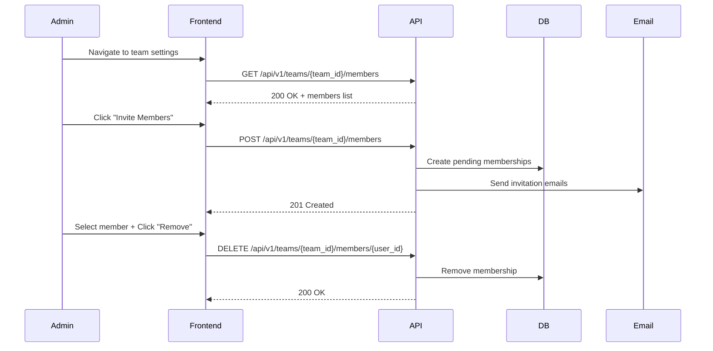

**Endpoint Details:**

**GET /api/v1/teams/{team_id}/members**
```json
// Response (200 OK)
{
  "team_id": "team_123abc",
  "members": [
    {
      "user_id": "user_123abc",
      "name": "Sarah Chen",
      "email": "sarah@example.com",
      "role": "team_admin",
      "assessment_status": "completed",
      "frameworks_completed": ["big_five", "mbti"],
      "last_assessment_date": "2025-01-10T15:30:00Z",
      "joined_at": "2025-01-01T00:00:00Z"
    },
    {
      "user_id": "user_456def",
      "name": "Marcus Johnson",
      "email": "marcus@example.com",
      "role": "team_member",
      "assessment_status": "pending",
      "frameworks_completed": [],
      "joined_at": "2025-01-05T00:00:00Z"
    }
  ],
  "total_members": 8,
  "members_completed": 5,
  "members_pending": 3
}
```

**POST /api/v1/teams/{team_id}/members**
```json
// Request
{
  "emails": ["john@example.com", "jane@example.com", "new@example.com"],
  "role": "team_member",
  "message": "Join our team on PsychSync!"  // Optional custom message
}

// Response (201 Created)
{
  "invited": [
    {
      "email": "john@example.com",
      "invitation_id": "inv_125",
      "status": "pending",
      "already_registered": false
    },
    {
      "email": "jane@example.com",
      "invitation_id": "inv_126",
      "status": "pending",
      "already_registered": false
    },
    {
      "email": "new@example.com",
      "error": "User already exists in team",
      "status": "skipped"
    }
  ],
  "invitations_sent": 2,
  "message": "2 invitations sent successfully"
}
```

**DELETE /api/v1/teams/{team_id}/members/{user_id}**
```json
// Response (200 OK)
{
  "message": "Member removed successfully",
  "user_id": "user_456def",
  "team_id": "team_123abc",
  "remaining_members": 7
}

// Error Responses
// 403 Forbidden - Cannot remove last admin
{
  "detail": "Cannot remove the last team admin"
}

// 404 Not Found
{
  "detail": "User not found in team"
}
```

---

### Journey 10: Export Team Data

**User Actions:**
1. Navigates to `/teams/{team_id}/export`
2. Selects export format (PDF, CSV, Excel)
3. Chooses data to include (assessments, insights, charts)
4. Clicks "Generate Export"
5. Downloads report

**API Sequence:**

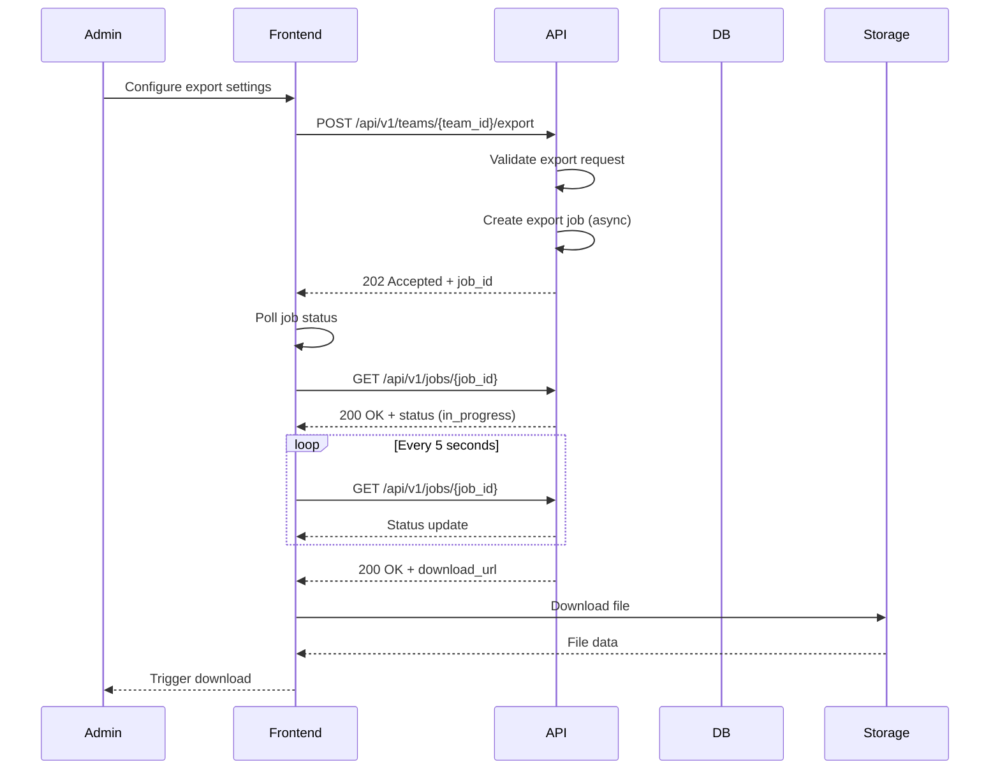

**Endpoint Details:**

**POST /api/v1/teams/{team_id}/export**
```json
// Request
{
  "format": "pdf",  // "pdf", "csv", "xlsx"
  "include_sections": {
    "individual_results": true,
    "team_insights": true,
    "constellation_map": true,
    "compatibility_matrix": true,
    "recommendations": true
  },
  "date_range": {
    "start": "2025-01-01T00:00:00Z",
    "end": "2025-01-12T23:59:59Z"
  }
}

// Response (202 Accepted)
{
  "job_id": "job_export_123",
  "status": "queued",
  "estimated_completion_seconds": 15,
  "message": "Export job started. You will receive an email when ready."
}
```

**GET /api/v1/jobs/{job_id}**
```json
// Response (200 OK) - Job in progress
{
  "job_id": "job_export_123",
  "status": "in_progress",
  "progress": 60,
  "message": "Generating team insights..."
}

// Response (200 OK) - Job complete
{
  "job_id": "job_export_123",
  "status": "completed",
  "progress": 100,
  "download_url": "https://cdn.psychsync.io/exports/team_123abc_2025-01-12.pdf",
  "expires_at": "2025-01-19T00:00:00Z",  // Link expires in 7 days
  "file_size_mb": 2.4,
  "message": "Export ready for download"
}
```

---

## Part 5: Advanced Features

### Journey 11: Real-Time Conflict Alert

**User Actions:**
1. Slack bot posts alert: "⚠️ Conflict risk detected between Sarah and Marcus (78% probability)"
2. User clicks link to PsychSync
3. Views conflict details
4. Reads resolution recommendations
5. Schedules mediation (optional)

**API Sequence:**

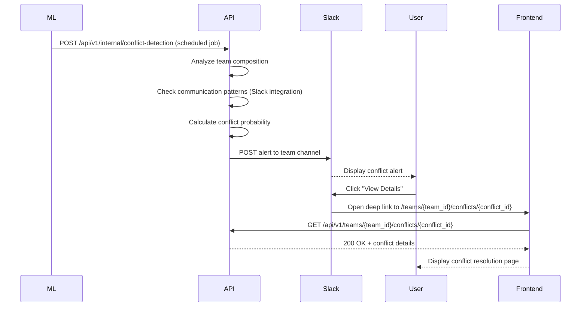

**Endpoint Details:**

**GET /api/v1/teams/{team_id}/conflicts/{conflict_id}**
```json
// Response (200 OK)
{
  "conflict_id": "conflict_123",
  "team_id": "team_123abc",
  "conflict_probability": 0.78,
  "risk_level": "high",
  "detected_at": "2025-01-12T10:00:00Z",
  "involved_members": [
    {
      "user_id": "user_123abc",
      "name": "Sarah Chen",
      "role": "Team Lead"
    },
    {
      "user_id": "user_456def",
      "name": "Marcus Johnson",
      "role": "Developer"
    }
  ],
  "risk_factors": [
    {
      "factor": "Personality mismatch",
      "description": "INTJ (Sarah) vs. ENFP (Marcus) - opposite communication styles",
      "weight": 0.6
    },
    {
      "factor": "Communication decline",
      "description": "Slack messages decreased by 65% in past 2 weeks",
      "weight": 0.3
    },
    {
      "factor": "Recent project stress",
      "description": "High-pressure deadline (detected from calendar integration)",
      "weight": 0.1
    }
  ],
  "predicted_conflict_type": "communication_breakdown",
  "resolution_recommendations": [
    {
      "priority": "high",
      "action": "Schedule facilitated 1:1",
      "description": "Have a neutral third party mediate a discussion between Sarah and Marcus",
      "timeline": "Within 48 hours"
    },
    {
      "priority": "medium",
      "action": "Use structured communication templates",
      "description": "Implement written agendas and decision logs for meetings",
      "timeline": "Immediate"
    },
    {
      "priority": "low",
      "action": "Personality-based communication tips",
      "description": "Share personalized collaboration tips with both members",
      "timeline": "Within 1 week"
    }
  ],
  "historical_context": {
    "previous_conflicts": 1,
    "last_conflict_date": "2024-11-15T00:00:00Z",
    "resolution_success_rate": 0.85
  }
}
```

---

### Journey 12: New Hire Impact Simulation

**User Actions:**
1. Navigates to `/teams/{team_id}/simulate`
2. Enters candidate's details (or uploads MBTI result)
3. Clicks "Simulate Impact"
4. Views predicted changes to team dynamics
5. Sees compatibility with existing members
6. Makes hiring decision

**API Sequence:**

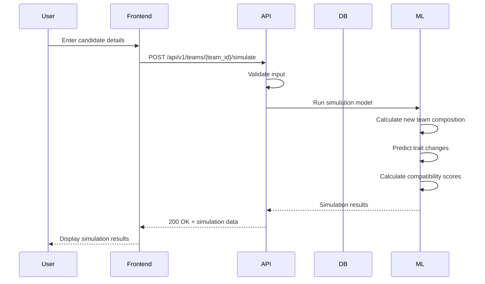

**Endpoint Details:**

**POST /api/v1/teams/{team_id}/simulate**
```json
// Request - Option 1: Enter personality scores directly
{
  "candidate_name": "Alejandro Martinez",
  "framework": "mbti",
  "scores": {
    "type": "ESTJ",
    "ei_score": 78,
    "sn_score": 65,
    "tf_score": 72,
    "jp_score": 85
  }
}

// Request - Option 2: Candidate's assessment result ID
{
  "result_id": "result_xyz",
  "candidate_name": "Alejandro Martinez"
}

// Response (200 OK)
{
  "simulation_id": "sim_456",
  "team_id": "team_123abc",
  "candidate": {
    "name": "Alejandro Martinez",
    "type": "ESTJ",
    "description": "The Executive: Organized, logical, and decisive"
  },
  "current_team_composition": {
    "member_count": 8,
    "avg_extraversion": 42,
    "avg_conscientiousness": 78,
    "avg_agreeableness": 55
  },
  "projected_team_composition": {
    "member_count": 9,
    "avg_extraversion": 48,  // +6 points
    "avg_conscientiousness": 79,  // +1 point
    "avg_agreeableness": 53  // -2 points
  },
  "impact_analysis": {
    "positive_impacts": [
      {
        "area": "Execution Speed",
        "description": "Alejandro's high Judging (85%) will accelerate decision-making",
        "magnitude": "+23%"
      },
      {
        "area": "Team Organization",
        "description": "ESTJ type adds structure and accountability",
        "magnitude": "+18%"
      }
    ],
    "potential_risks": [
      {
        "area": "Creativity",
        "description": "Team Openness may decrease slightly (ESTJ is practical-focused)",
        "magnitude": "-8%"
      },
      {
        "area": "Team Harmony",
        "description": "Low Agreeableness may increase direct debates",
        "magnitude": "-5%"
      }
    ]
  },
  "compatibility_with_existing_members": [
    {
      "member_name": "Sarah Chen (INTJ)",
      "compatibility_score": 85,
      "description": "Highly compatible - both value structure and efficiency"
    },
    {
      "member_name": "Marcus Johnson (ENFP)",
      "compatibility_score": 52,
      "description": "Moderate compatibility - may clash on decision-making speed, need clear role boundaries"
    }
  ],
  "overall_fit_score": 74,
  "recommendation": "Good fit - Alejandro will boost execution speed while maintaining team's high standards. Consider pairing him with creative team members to balance practicality.",
  "blind_spot_analysis": {
    "new_blind_spot": "With Alejandro's ESTJ type, team may become too rigid in procedures. Balance with creative thinkers.",
    "addressed_blind_spot": "Alejandro's Extraversion (78%) helps balance team's introverted majority (current avg: 42%)"
  }
}
```

---

## Part 6: Error Handling & Edge Cases

### Standard Error Response Format

```json
{
  "error": {
    "code": "VALIDATION_ERROR",
    "message": "Invalid request data",
    "details": [
      {
        "field": "email",
        "message": "Invalid email format"
      },
      {
        "field": "password",
        "message": "Password must be at least 8 characters"
      }
    ],
    "request_id": "req_abc123",
    "timestamp": "2025-01-12T10:30:00Z"
  }
}
```

### Common HTTP Status Codes

| Status Code | Meaning | Example Use Case |
|-------------|---------|------------------|
| 200 OK | Success | Login successful, data retrieved |
| 201 Created | Resource created | User registered, team created |
| 202 Accepted | Request accepted, async processing | Export started, assessment scoring |
| 400 Bad Request | Invalid input | Missing required field, invalid email |
| 401 Unauthorized | Authentication required | Missing or invalid token |
| 403 Forbidden | Insufficient permissions | Viewing another user's results |
| 404 Not Found | Resource not found | Assessment result doesn't exist |
| 409 Conflict | Conflict with existing data | Email already registered |
| 422 Unprocessable Entity | Semantically incorrect | Invalid state transition |
| 429 Too Many Requests | Rate limit exceeded | Too many login attempts |
| 500 Internal Server Error | Server error | Unexpected exception |
| 503 Service Unavailable | Service down | Maintenance mode |

### Client-Side Retry Logic

```typescript
// src/utils/api.ts
export const apiCall = async (
  fn: () => Promise<AxiosResponse>,
  retries = 3
): Promise<AxiosResponse> => {
  try {
    return await fn();
  } catch (error) {
    if (error.response?.status === 429 && retries > 0) {
      // Rate limited - wait and retry
      await new Promise(resolve => setTimeout(resolve, 1000));
      return apiCall(fn, retries - 1);
    }
    if (error.response?.status === 401) {
      // Unauthorized - redirect to login
      window.location.href = '/login';
    }
    if (error.response?.status >= 500 && retries > 0) {
      // Server error - retry
      await new Promise(resolve => setTimeout(resolve, 2000));
      return apiCall(fn, retries - 1);
    }
    throw error;
  }
};
```

---

## Part 7: Performance Optimization

### Caching Strategy

| Data Type | Cache Duration | Invalidation Trigger |
|-----------|----------------|----------------------|
| User profile | 1 hour | User updates profile |
| Assessment questions | 24 hours | Assessment updated |
| Team insights | 1 hour | New member completes assessment |
| Individual results | Never (no cache) | N/A |
| Conflict predictions | 6 hours | Daily job recalculation |

### API Rate Limiting

| Endpoint | Rate Limit | Window |
|----------|------------|--------|
| POST /auth/login | 5 requests | 1 minute |
| POST /auth/register | 3 requests | 1 hour |
| GET /assessments | 100 requests | 1 minute |
| POST /responses/*/answers | 10 requests | 1 second |
| GET /teams/*/insights | 30 requests | 1 minute |

### Pagination

```json
// Request
GET /api/v1/teams/{team_id}/members?page=1&per_page=10

// Response
{
  "members": [...],
  "pagination": {
    "current_page": 1,
    "per_page": 10,
    "total_pages": 3,
    "total_members": 25,
    "has_next": true,
    "has_prev": false
  }
}
```

---

## Part 8: Webhook Integration (Optional)

### Webhook Events

PsychSync can send webhooks to external systems for:

1. **assessment.completed** - User finishes an assessment
2. **team.insights_ready** - All members completed, insights available
3. **conflict.detected** - High conflict probability detected
4. **member.joined** - New member joins team

### Webhook Payload Example

```json
POST https://your-system.com/webhooks
{
  "event": "assessment.completed",
  "timestamp": "2025-01-12T10:45:00Z",
  "data": {
    "user_id": "user_123abc",
    "team_id": "team_123abc",
    "assessment_id": "assessment_mbti",
    "result_id": "result_xyz",
    "type": "INTJ"
  }
}
```

---

**Next Steps:**
1. Frontend team: Review endpoints and build API client
2. Backend team: Implement missing endpoints (prioritized by user journey)
3. QA team: Create test cases for each user journey
4. Documentation team: Generate OpenAPI spec from this document
5. DevOps team: Set up monitoring and alerting for API performance

---

*For questions or feedback, contact: engineering@psychsync.io*
