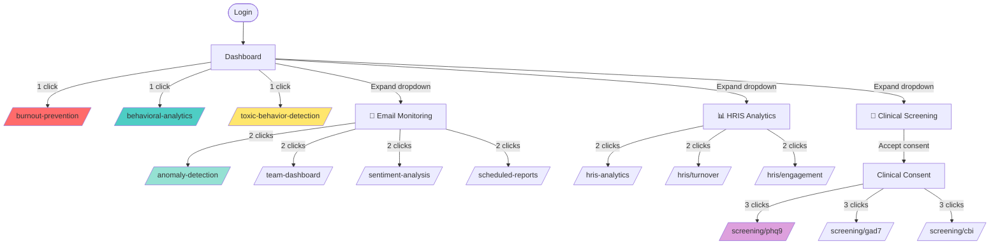

# PsychSync Feature Discovery Flow
## Burnout & Risk Detection Features User Journey

---

## 🚀 Primary Entry Points

```
┌─────────────────────────────────────────────────────────────┐
│                    PSYCHSYNC PLATFORM                        │
└─────────────────────────────────────────────────────────────┘
                              │
                              ▼
┌─────────────────────────────────────────────────────────────┐
│  ENTRY POINT 1: Landing Page (/)                            │
│  ━━━━━━━━━━━━━━━━━━━━━━━━━━━━━━━━━━━━━━━━━━━━━━━━━━━━━━━━│
│  • ImprovedLanding component                                 │
│  • Quick Value Preview for new users                         │
│  • "Get Started" → Registration flow                         │
└─────────────────────────────────────────────────────────────┘
                              │
                              ▼
┌─────────────────────────────────────────────────────────────┐
│  ENTRY POINT 2: Login/Registration (/login, /register)       │
│  ━━━━━━━━━━━━━━━━━━━━━━━━━━━━━━━━━━━━━━━━━━━━━━━━━━━━━━━━│
│  • StreamlinedRegister for quick signup                      │
│  • Email verification required                               │
│  • ProgressiveDashboard for onboarding                       │
└─────────────────────────────────────────────────────────────┘
                              │
                              ▼
┌─────────────────────────────────────────────────────────────┐
│  ENTRY POINT 3: Dashboard (/dashboard) 🏠 HUB                │
│  ━━━━━━━━━━━━━━━━━━━━━━━━━━━━━━━━━━━━━━━━━━━━━━━━━━━━━━━━│
│  Central navigation hub with:                                │
│  • Quick stats overview                                      │
│  • Action items & alerts                                     │
│  • Featured recommendations                                   │
│  • Sidebar navigation (primary discovery)                     │
└─────────────────────────────────────────────────────────────┘
```

---

## 📱 Primary Navigation: Sidebar Structure

```
┌─────────────────────────────────────────────────────────────┐
│  SIDEBAR NAVIGATION (Always Visible)                         │
│  ━━━━━━━━━━━━━━━━━━━━━━━━━━━━━━━━━━━━━━━━━━━━━━━━━━━━━━━━│
│                                                              │
│  📊 Dashboard              [Always visible]                   │
│  🎨 Icon Gallery           [Always visible]                   │
│  👥 Teams                  [Always visible]                   │
│  ───────────────────────────────────────────────────────────│
│  🔥 Burnout Prevention     [★ DISCOVERY POINT 1]             │
│  🧠 Behavioral Analytics   [★ DISCOVERY POINT 2]             │
│  🛡️ Toxic Behavior Detect. [★ DISCOVERY POINT 3]             │
│  🔒 Anonymous Feedback    [Always visible]                   │
│  ───────────────────────────────────────────────────────────│
│  📧 Email Monitoring ▼     [Dropdown - DISCOVERY POINT 4]    │
│  📊 HRIS Analytics ▼       [Dropdown - DISCOVERY POINT 5]    │
│  🏥 Clinical Screening ▼   [Dropdown - DISCOVERY POINT 6]    │
│  🏥 Clinical Services ▼    [Dropdown - DISCOVERY POINT 7]    │
│  ───────────────────────────────────────────────────────────│
│  ⚙️ Settings               [Always visible]                   │
│                                                              │
└─────────────────────────────────────────────────────────────┘
```

---

## 🗺️ Detailed Feature Discovery Flows

### FLOW 1: Burnout Prevention Discovery

```
USER ACTION                    FEATURE DISCOVERED
─────────────────────────────────────────────────────────────→

Login → Dashboard
  │
  ├─→ Sidebar: "🔥 Burnout Prevention"
  │   └─→ /burnout-prevention
  │       │
  │       ├─→ Overview Tab
  │       │   ├─ Overall Risk Score (0-100)
  │       │   ├─ 7-Day Probability %
  │       │   ├─ 90-Day Turnover Risk %
  │       │   └─ Early Warning Indicators (5 signals)
  │       │
  │       ├─→ Risk Factors Tab
  │       │   ├─ Work Hours Analysis
  │       │   ├─ Recovery Time Score
  │       │   ├─ Sentiment Trend
  │       │   ├─ Social Withdrawal
  │       │   └─ Response Pattern Changes
  │       │
  │       ├─→ Team View Tab
  │       │   └─ Team Burnout Heatmap
  │       │
  │       ├─→ Interventions Tab
  │       │   └─ Personalized Action Plans
  │       │
  │       └─→ Cultural Tab
  │           ├─ Karoshi Prevention (Japan)
  │           └─ Gapjil Prevention (Korea)
  │
  └─→ DISCOVERY PATH: Direct sidebar access
```

### FLOW 2: Behavioral Analytics Discovery

```
USER ACTION                    FEATURE DISCOVERED
─────────────────────────────────────────────────────────────→

Dashboard
  │
  ├─→ Sidebar: "🧠 Behavioral Analytics"
  │   └─→ /behavioral-analytics
  │       │
  │       ├─→ Communication Patterns
  │       │   ├─ Email Volume Analysis
  │       │   ├─ Response Time Trends
  │       │   └─ Sentiment Analysis
  │       │
  │       ├─→ Work Pattern Analysis
  │       │   ├─ Work Hours Tracking
  │       │   ├─ After-Hours Activity
  │       │   └─ Weekend Work Detection
  │       │
  │       └─→ Behavioral Risk Indicators
  │           ├─ Social Withdrawal Signs
  │           ├─ Communication Overload
  │           └─ Stress Pattern Detection
  │
  └─→ DISCOVERY PATH: Direct sidebar access
```

### FLOW 3: Email Monitoring Features Discovery

```
USER ACTION                    FEATURE DISCOVERED
─────────────────────────────────────────────────────────────→

Dashboard
  │
  ├─→ Sidebar: "📧 Email Monitoring" ▼ (Expand dropdown)
  │   │
  │   ├─→ "⚠️ Anomaly Detection"
  │   │   └─→ /anomaly-detection
  │   │       ├─ ML-Powered Pattern Detection
  │   │       ├─ Unusual Behavior Alerts
  │   │       └─ Risk Anomaly Visualization
  │   │
  │   ├─→ "👥 Team Dashboard"
  │   │   └─→ /team-dashboard
  │   │       ├─ Team Performance Metrics
  │   │       ├─ Communication Load Distribution
  │   │       └─ Team-Level Risk Indicators
  │   │
  │   ├─→ "😊 Sentiment Analysis"
  │   │   └─→ /sentiment-analysis
  │   │       ├─ Email Tone Analysis
  │   │       ├─ Emotion Detection
  │   │       └─ Sentiment Trends Over Time
  │   │
  │   └─→ "📅 Scheduled Reports"
  │       └─→ /scheduled-reports
  │           ├─ Automated Weekly Reports
  │           ├─ Monthly Wellness Summaries
  │           └─ Custom Report Scheduling
  │
  └─→ DISCOVERY PATH: Dropdown expansion required
```

### FLOW 4: HRIS Analytics Features Discovery

```
USER ACTION                    FEATURE DISCOVERED
─────────────────────────────────────────────────────────────→

Dashboard
  │
  ├─→ Sidebar: "📊 HRIS Analytics" ▼ (Expand dropdown)
  │   │
  │   ├─→ "📈 Analytics Dashboard"
  │   │   └─→ /hris-analytics
  │   │       ├─ 7 Key Performance Indicators
  │   │       ├─ Real-time Metrics
  │   │       └─ Custom Reports
  │   │
  │   ├─→ "🔗 HRIS Connector"
  │   │   └─→ /hris-connector
  │   │       ├─ Workday Integration
  │   │       ├─ BambooHR Integration
  │   │       └─ 30+ HR Systems
  │   │
  │   ├─→ "📉 Turnover Analysis"
  │   │   └─→ /hris/turnover
  │   │       ├─ Turnover Pattern Detection
  │   │       ├─ Retention Risk Prediction
  │   │       └─ Exit Reason Analysis
  │   │
  │   ├─→ "😊 Engagement Analytics"
  │   │   └─→ /hris/engagement
  │   │       ├─ Employee Satisfaction Scores
  │   │       ├─ Engagement Trends
  │   │       └─ Workplace Pulse
  │   │
  │   └─→ "🎯 Succession Planning"
  │       └─→ /hris/succession
  │           ├─ Leadership Pipeline
  │           ├─ Readiness Scores
  │           └─ Key Position Identification
  │
  └─→ DISCOVERY PATH: Dropdown expansion required
```

### FLOW 5: Clinical Screening Discovery

```
USER ACTION                    FEATURE DISCOVERED
─────────────────────────────────────────────────────────────→

Dashboard
  │
  ├─→ Sidebar: "🏥 Clinical Screening" ▼ (Expand dropdown)
  │   │
  │   ├─→ "💙 Depression Screening (PHQ-9)"
  │   │   └─→ /screening/phq9
  │   │       └─ Depression Risk Assessment (α=0.89)
  │   │
  │   ├─→ "💛 Anxiety Screening (GAD-7)"
  │   │   └─→ /screening/gad7
  │   │       └─ Anxiety Risk Assessment (α=0.92)
  │   │
  │   ├─→ "🚨 Suicide Risk (C-SSRS)"
  │   │   └─→ /screening/cssrs
  │   │       └─ Crisis Risk Assessment (AUC=0.83)
  │   │
  │   ├─→ "🔥 Burnout (CBI)"
  │   │   └─→ /screening/cbi
  │   │       └─ Copenhagen Burnout Inventory
  │   │
  │   ├─→ "😰 Perceived Stress (PSS-10)"
  │   │   └─→ /screening/pss10
  │   │       └─ Stress Level Assessment (α=0.78)
  │   │
  │   └─→ "📊 DASS-21 (Depression/Anxiety/Stress)"
  │       └─→ /screening/dass21
  │           └─ Multi-Symptom Assessment (α=0.84-0.91)
  │
  └─→ DISCOVERY PATH: Dropdown expansion required
       └─→ CLINICAL CONSENT required before access
```

### FLOW 6: Clinical Services & Resources Discovery

```
USER ACTION                    FEATURE DISCOVERED
─────────────────────────────────────────────────────────────→

Dashboard
  │
  ├─→ Sidebar: "🏥 Clinical Services & Resources" ▼
  │   │
  │   ├─→ "📹 Telehealth - Schedule Consultation"
  │   │   └─→ /telehealth/schedule
  │   │       └─ Schedule Video Consultation
  │   │
  │   ├─→ "🤖 AI Chat Support"
  │   │   └─→ /support/chat
  │   │       └─ 24/7 AI-Powered Mental Health Support
  │   │
  │   ├─→ "📊 Clinical Analytics"
  │   │   └─→ /analytics/clinical
  │   │       ├─ Population Health Insights
  │   │       └─ Clinical Risk Trends
  │   │
  │   ├─→ "🏥 Population Health"
  │   │   └─→ /analytics/population-health
  │   │       ├─ Population Metrics
  │   │       └─ High-Risk Identification
  │   │
  │   └─→ "🚨 Alerts Center"
  │       └─→ /clinical/alerts-center
  │           ├─ Automated Crisis Alerts
  │           └─ High-Risk User Notifications
  │
  └─→ DISCOVERY PATH: Dropdown expansion required
```

---

## 🎯 Feature Discovery Matrix

| Feature | Discovery Method | Visibility | Clicks to Access | User Action Required |
|---------|-----------------|------------|-----------------|---------------------|
| **Burnout Prevention** | Sidebar direct | High | 1 click | None |
| **Behavioral Analytics** | Sidebar direct | High | 1 click | None |
| **Toxic Behavior Detection** | Sidebar direct | High | 1 click | None |
| **Anomaly Detection** | Dropdown expansion | Medium | 2 clicks | Expand "Email Monitoring" |
| **Team Dashboard** | Dropdown expansion | Medium | 2 clicks | Expand "Email Monitoring" |
| **Sentiment Analysis** | Dropdown expansion | Medium | 2 clicks | Expand "Email Monitoring" |
| **Scheduled Reports** | Dropdown expansion | Medium | 2 clicks | Expand "Email Monitoring" |
| **HRIS Analytics Dashboard** | Dropdown expansion | Medium | 2 clicks | Expand "HRIS Analytics" |
| **Turnover Analysis** | Dropdown expansion | Low | 2 clicks | Expand "HRIS Analytics" |
| **Engagement Analytics** | Dropdown expansion | Low | 2 clicks | Expand "HRIS Analytics" |
| **Clinical Screening** | Dropdown + Consent | Medium | 3 clicks | Expand + Accept Consent |
| **Telehealth** | Dropdown expansion | Medium | 2 clicks | Expand "Clinical Services" |
| **Population Health** | Dropdown expansion | Low | 2 clicks | Expand "Clinical Services" |

---

## 🚦 Navigation Optimization Recommendations

### Current Issues:
1. **Dropdown Hiding**: Many features are buried in dropdowns (2+ clicks to discover)
2. **No Search**: Users must remember where features are located
3. **Flat Structure**: 23 items in Clinical Screening dropdown = cognitive overload
4. **No Feature Prominence**: Important features like "Burnout Prevention" are same visual weight as "Icon Gallery"

### Suggested Improvements:

```
OPTION 1: Smart Search (Recommended)
┌─────────────────────────────────────┐
│ 🔍 Search features...               │
│   ━━━━━━━━━━━━━━━━━━━━━━━━━━━━━━━  │
│   🔥 Burnout Prevention            │
│   📧 Email → Anomaly Detection      │
│   📊 HRIS → Turnover Analysis       │
└─────────────────────────────────────┘

OPTION 2: Quick Actions Panel (Dashboard)
┌─────────────────────────────────────┐
│ ⚡ QUICK ACTIONS                    │
│ ━━━━━━━━━━━━━━━━━━━━━━━━━━━━━━━━━━│
│ 📊 Check My Burnout Risk            │
│ 🧠 View Behavioral Analytics        │
│ 📧 View Email Sentiment             │
│ 🏥 Take Clinical Assessment         │
└─────────────────────────────────────┘

OPTION 3: Feature Discovery Wizard
┌─────────────────────────────────────┐
│ ✨ Discover Features                │
│ ━━━━━━━━━━━━━━━━━━━━━━━━━━━━━━━━━━│
│ Based on your role, you might like:│
│ • Burnout Prevention                │
│ • Team Analytics                    │
│ • Clinical Screening                │
└─────────────────────────────────────┘
```

---

## 📊 Feature Discovery Metrics

Track these metrics to understand feature discovery:

```typescript
// Analytics events to track
interface FeatureDiscoveryEvents {
  // Sidebar interactions
  'sidebar_item_click': { feature_name: string };
  'dropdown_expand': { section_name: string };
  'dropdown_collapse': { section_name: string };

  // Feature discovery
  'feature_discovered': {
    feature_name: string;
    discovery_method: 'sidebar' | 'dropdown' | 'search' | 'recommendation';
    time_to_discover: number; // seconds from login
    clicks_required: number;
  };

  // Feature usage
  'feature_first_use': {
    feature_name: string;
    time_from_discovery: number; // seconds
  };

  // Abandonment
  'feature_abandoned': {
    feature_name: string;
    time_spent: number;
    abandonment_point: string;
  };
}
```

---

## 🎨 Visual Navigation Flow (Mermaid Diagram)



---

## 🎯 User Personas & Feature Discovery Paths

### Persona 1: HR Manager
**Goal**: Monitor team burnout and turnover risk
**Primary Features**: Burnout Prevention, Team Dashboard, Turnover Analysis

```
Discovery Path:
Login → Dashboard → HRIS Analytics ▼ → Turnover Analysis
              ↓
         Burnout Prevention → Team View Tab
```

### Persona 2: Individual Employee
**Goal**: Monitor personal mental health and stress
**Primary Features**: Burnout Prevention, Behavioral Analytics, Clinical Screening

```
Discovery Path:
Login → Dashboard → Burnout Prevention
              ↓
         Behavioral Analytics
              ↓
         Clinical Screening ▼ → Stress (PSS-10)
```

### Persona 3: Clinician
**Goal**: Monitor patient population health
**Primary Features**: Population Health, Clinical Analytics, Alerts Center

```
Discovery Path:
Login → Dashboard → Clinical Services ▼ → Population Health
              ↓
         Alerts Center
```

### Persona 4: Team Lead
**Goal**: Monitor team communication patterns
**Primary Features**: Team Dashboard, Sentiment Analysis, Anomaly Detection

```
Discovery Path:
Login → Dashboard → Email Monitoring ▼ → Team Dashboard
              ↓
         Sentiment Analysis
```

---

## 📝 Summary: Current State vs. Recommended State

| Aspect | Current | Recommended |
|--------|---------|-------------|
| **Burnout Prevention** | 1 click (sidebar) | ✅ Optimal |
| **Behavioral Analytics** | 1 click (sidebar) | ✅ Optimal |
| **Email Monitoring Features** | 2 clicks (dropdown) | ⚠️ Add to search |
| **HRIS Analytics Features** | 2 clicks (dropdown) | ⚠️ Add role-based home |
| **Clinical Screening** | 3 clicks (dropdown + consent) | ⚠️ Add quick-access cards |
| **Feature Search** | ❌ Not available | 🆕 Add global search |
| **Feature Recommendations** | ❌ Not available | 🆕 Add "For You" section |
| **Onboarding Tour** | ❌ Not available | 🆕 Add feature walkthrough |

---

## 🚀 Next Steps

To improve feature discovery:

1. **Add Feature Search** (Priority: HIGH)
   - Global search bar in sidebar
   - Fuzzy search for feature names
   - Recent features quick access

2. **Smart Recommendations** (Priority: HIGH)
   - Role-based feature suggestions
   - "Based on your usage..." recommendations
   - Feature discovery carousel on dashboard

3. **Flatten Dropdown Structure** (Priority: MEDIUM)
   - Move critical features (Anomaly Detection) to top-level
   - Group related features in sub-sections
   - Reduce cognitive load

4. **Feature Onboarding** (Priority: MEDIUM)
   - First-login feature tour
   - Progressive disclosure of features
   - Contextual tooltips

5. **Analytics & Optimization** (Priority: LOW)
   - Track feature discovery rates
   - A/B test navigation structures
   - Optimize based on usage patterns
