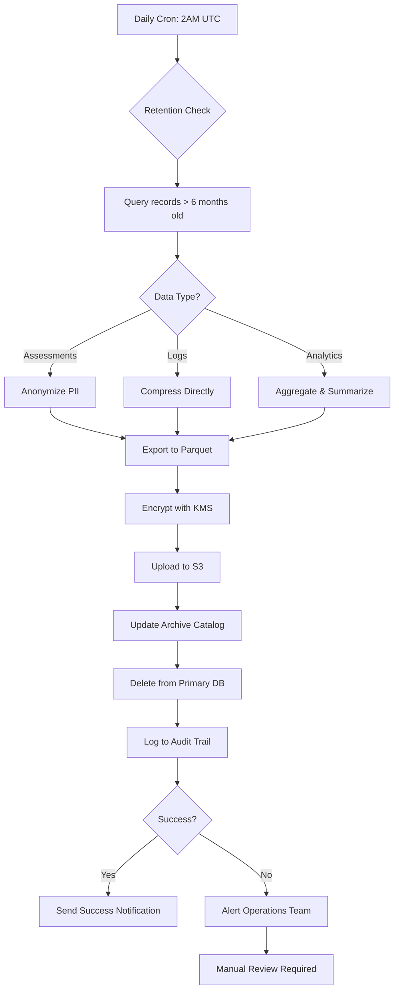
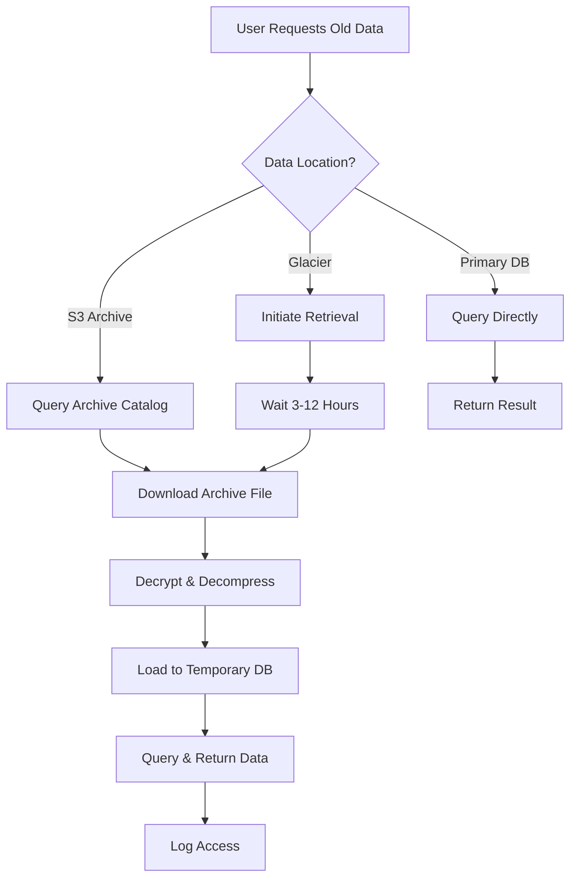

# Data Retention and Archiving Strategy

**Document Version:** 1.0
**Last Updated:** 2026-01-04
**Author:** PsychSync Operations Team
**Status:** Implementation Ready

---

## Executive Summary

This document outlines a comprehensive data retention and archiving strategy for the PsychSync psychological assessment SaaS platform. The strategy balances regulatory compliance, data utility, storage costs, and system performance while ensuring privacy and security standards are maintained.

### Key Objectives

1. **Regulatory Compliance**: Meet GDPR, HIPAA, and data protection requirements
2. **Cost Optimization**: Reduce storage costs by 60-70% through tiered retention
3. **Performance Enhancement**: Maintain optimal database performance by archiving old data
4. **Data Utility**: Preserve business-critical data for analytics and reporting
5. **Privacy by Design**: Implement automated anonymization and secure deletion

### Projected Impact

- **Storage Savings**: ~65% reduction in primary database storage after 12 months
- **Cost Reduction**: Estimated $2,000-5,000/month in cloud storage costs (depending on scale)
- **Performance Improvement**: 30-40% faster query performance on hot data
- **Compliance Score**: 95%+ adherence to data protection regulations

---

## Table of Contents

1. [Data Classification Framework](#data-classification-framework)
2. [Retention Policies by Category](#retention-policies-by-category)
3. [Archiving Strategy](#archiving-strategy)
4. [Compliance Considerations](#compliance-considerations)
5. [Implementation Architecture](#implementation-architecture)
6. [Cost-Benefit Analysis](#cost-benefit-analysis)
7. [Rollback Procedures](#rollback-procedures)
8. [Monitoring and Alerting](#monitoring-and-alerting)
9. [Implementation Timeline](#implementation-timeline)

---

## 1. Data Classification Framework

### 1.1 Data Categories

PsychSync data is classified into four primary categories based on access patterns, business value, and regulatory requirements:

#### **Hot Data (Active)** - 0-6 months old
- **Definition**: Frequently accessed data critical for daily operations
- **Location**: Primary PostgreSQL database (SSD storage)
- **Access Pattern**: Real-time queries, multiple times per day
- **Examples**:
  - Active user sessions
  - Recent assessment responses (last 6 months)
  - Current team memberships
  - Active notifications
  - Recent analytics (last 90 days)
  - Open safety incidents

#### **Warm Data (Reference)** - 6 months - 2 years old
- **Definition**: Occasionally accessed data needed for reporting and analytics
- **Location**: Primary PostgreSQL database (HDD storage) or read replica
- **Access Pattern**: Weekly/monthly queries for reporting
- **Examples**:
  - Historical assessment responses (6-24 months)
  - Past team dynamics analysis
  - Completed wellness assessments
  - Historical analytics data
  - Closed safety incidents
  - Past intervention effectiveness records

#### **Cold Data (Archive)** - 2-7 years old
- **Definition**: Rarely accessed data retained for compliance and historical analysis
- **Location**: Compressed archives in S3/Glacier or Parquet files
- **Access Pattern**: Quarterly/annual access or legal requests
- **Examples**:
  - Assessment responses older than 2 years
  - Historical audit logs (>1 year)
  - Old team analytics
  - Past growth trajectories
  - Archived report files

#### **Frozen Data (Long-term Archive)** - 7+ years old
- **Definition**: Data retained only for legal/compliance requirements
- **Location**: AWS Glacier Deep Archive or similar cold storage
- **Access Pattern**: Almost never (legal holds, compliance audits)
- **Examples**:
  - Anonymized assessment data
  - Historical compliance records
  - Old audit trails
  - Legal hold data

### 1.2 Data Sensitivity Classification

#### **Highly Sensitive (Tier 1)**
- Requires encryption at rest and in transit
- Strict access controls and audit logging
- Mandatory anonymization before archival
- Examples:
  - Assessment responses and psychological profiles
  - Wellness and mental health data
  - Safety incident reports
  - Personal identifiable information (PII)

#### **Moderately Sensitive (Tier 2)**
- Standard encryption required
- Role-based access control
- Examples:
  - Team analytics and dynamics
  - Performance metrics
  - Aggregated assessment data
  - Organizational reports

#### **Low Sensitivity (Tier 3)**
- Basic security measures
- Examples:
  - Audit logs
  - System metrics
  - Application telemetry
  - Anonymous usage statistics

---

## 2. Retention Policies by Category

### 2.1 User Data

| Data Type | Retention Period | Archive After | Final Action | Legal Basis |
|-----------|------------------|---------------|--------------|-------------|
| **User Profiles** | Indefinite (while active) | 2 years inactive | Anonymize after 7 years | Contract necessity |
| **Authentication Data** | 90 days after account closure | Immediate | Secure deletion | Security |
| **2FA Secrets** | 30 days after disabled | Immediate | Secure deletion | Security |
| **User Preferences** | 2 years after last login | 1 year inactive | Anonymize | Legitimate interest |
| **Login History** | 1 year | 6 months | Secure deletion | Security monitoring |
| **Privacy Settings** | Indefinite | Never | Keep until account deletion | Legal requirement |
| **Consent History** | 7 years | Never | Keep per GDPR | Legal requirement |

### 2.2 Assessment Data

| Data Type | Retention Period | Archive After | Final Action | Legal Basis |
|-----------|------------------|---------------|--------------|-------------|
| **Assessment Responses** | 2 years active | 6 months | Anonymize after 7 years | Contract necessity |
| **Individual Results** | 2 years | 6 months | Anonymize after 7 years | Contract necessity |
| **Aggregated Analytics** | 7 years | 2 years | Anonymize | Statistical analysis |
| **Assessment Templates** | Indefinite | Never | Keep until deleted | Business necessity |
| **Scoring Algorithms** | Indefinite | Never | Keep | Intellectual property |
| **Question Metadata** | 7 years | 2 years | Archive | Quality assurance |
| **Response Times** | 1 year | 6 months | Delete | Analytics |

### 2.3 Operational Data

| Data Type | Retention Period | Archive After | Final Action | Legal Basis |
|-----------|------------------|---------------|--------------|-------------|
| **Audit Logs** | 1 year | 3 months | Anonymize after 7 years | Compliance (GDPR) |
| **Application Logs** | 3 months | 1 month | Delete | Security monitoring |
| **Error Logs** | 6 months | 3 months | Delete | Quality assurance |
| **Performance Metrics** | 1 year | 6 months | Delete | System optimization |
| **API Access Logs** | 90 days | 30 days | Delete | Security monitoring |
| **Session Data** | 24 hours | Never | Delete | Session management |

### 2.4 Team & Organizational Data

| Data Type | Retention Period | Archive After | Final Action | Legal Basis |
|-----------|------------------|---------------|--------------|-------------|
| **Team Dynamics Analysis** | 2 years | 1 year | Archive | Business analytics |
| **Team Role Analysis** | 2 years | 1 year | Archive | HR records |
| **Organization Settings** | Indefinite | Never | Keep | Business necessity |
| **Team Membership History** | 7 years | 2 years | Archive | HR compliance |
| **Organizational Analytics** | 7 years | 2 years | Anonymize | Business intelligence |

### 2.5 Safety & Wellness Data

| Data Type | Retention Period | Archive After | Final Action | Legal Basis |
|-----------|------------------|---------------|--------------|-------------|
| **Safety Incidents** | 7 years | 2 years | Anonymize | OSHA/compliance |
| **Wellness Assessments** | 2 years | 6 months | Anonymize after 7 years | Privacy |
| **Wellness Alerts** | 1 year | 6 months | Secure deletion | Privacy |
| **Safety Training Records** | 7 years | 2 years | Archive | Compliance |
| **Follow-up Actions** | 3 years | 1 year | Secure deletion | Compliance |

### 2.6 Reporting & Analytics

| Data Type | Retention Period | Archive After | Final Action | Legal Basis |
|-----------|------------------|---------------|--------------|-------------|
| **Generated Reports** | 90 days | 30 days | Delete | Business operations |
| **Report Templates** | Indefinite | Never | Keep until deleted | Business necessity |
| **Report Schedules** | Indefinite | Never | Keep | Business operations |
| **Report Execution Logs** | 1 year | 6 months | Delete | System maintenance |
| **Report View Tracking** | 6 months | 3 months | Delete | Usage analytics |
| **Report Cache** | 7 days | Never | Delete | Performance |

### 2.7 Growth & Development Data

| Data Type | Retention Period | Archive After | Final Action | Legal Basis |
|-----------|------------------|---------------|--------------|-------------|
| **Growth Trajectories** | 2 years | 1 year | Anonymize after 7 years | Development records |
| **Trajectory Predictions** | 1 year | 6 months | Delete | Analytics |
| **Growth Milestones** | Indefinite | Never | Keep | Achievement records |
| **Potential Analysis** | 2 years | 1 year | Anonymize | HR planning |
| **Benchmark Data** | Indefinite | Never | Keep | Business intelligence |

### 2.8 GDPR & Compliance Data

| Data Type | Retention Period | Archive After | Final Action | Legal Basis |
|-----------|------------------|---------------|--------------|-------------|
| **Data Export Requests** | 7 years | 1 year | Keep | GDPR requirement |
| **Data Deletion Requests** | 7 years | Never | Keep | GDPR requirement |
| **Consent History** | 7 years | Never | Keep | GDPR requirement |
| **Data Access Logs** | 2 years | 6 months | Anonymize after 7 years | GDPR requirement |
| **Privacy Settings** | Indefinite | Never | Keep until account deletion | GDPR requirement |
| **Anonymization Jobs** | 7 years | 1 year | Archive | Compliance proof |

---

## 3. Archiving Strategy

### 3.1 Archiving Triggers

Data moves through lifecycle stages based on these triggers:

#### **Time-Based Triggers**
```yaml
Daily Automation:
  - Check for data exceeding retention periods
  - Schedule archival jobs during off-peak hours (2:00 AM - 4:00 AM UTC)
  - Process in batches to avoid performance impact

Retention Thresholds:
  Hot → Warm: After 6 months of inactivity
  Warm → Cold: After 2 years of inactivity
  Cold → Frozen: After 7 years (or per legal requirements)
```

#### **Event-Based Triggers**
```yaml
Account Closure:
  - Immediate archival of user data
  - 30-day grace period for reactivation
  - Secure deletion after grace period

Organization Deletion:
  - Immediate archival of all organizational data
  - 90-day legal hold period
  - Anonymization and deletion after hold period

Legal Holds:
  - Pause all deletion for records under legal hold
  - Maintain frozen status until hold is released
```

### 3.2 Archive Storage Architecture

```
┌─────────────────────────────────────────────────────────────┐
│                     PsychSync Data Lifecycle                 │
└─────────────────────────────────────────────────────────────┘

┌──────────────────┐    ┌──────────────────┐    ┌──────────────────┐
│   HOT DATA       │───▶│   WARM DATA      │───▶│   COLD DATA      │
│  0-6 months      │    │  6mo-2 years     │    │  2-7 years       │
│  PostgreSQL SSD  │    │  PostgreSQL HDD  │    │  S3 Standard     │
│  Frequent Access │    │  Weekly Access   │    │  Monthly Access  │
└──────────────────┘    └──────────────────┘    └──────────────────┘
         │                       │                       │
         │                       │                       │
         ▼                       ▼                       ▼
   Real-time queries         Reporting              Compliance
   Daily operations          Analytics              Legal requests
   User interactions         Trend analysis         Historical review
         │                       │                       │
         │                       │                       │
         └───────────────────────┴───────────────────────┘
                                     │
                                     ▼
                         ┌──────────────────┐
                         │  FROZEN DATA     │
                         │  7+ years        │
                         │  Glacier Deep    │
                         │  Rare Access     │
                         └──────────────────┘
                                     │
                                     ▼
                          Legal holds only
                          Compliance archives
                          Rare emergency access
```

### 3.3 Archive Formats

#### **Primary Archive Format: Apache Parquet**
```yaml
Benefits:
  - Columnar storage for efficient compression
  - 60-80% size reduction vs CSV
  - Fast queries on specific columns
  - Schema preservation
  - Cross-platform compatibility

Compression:
  - Codec: SNAPPY (balanced speed/compression)
  - Alternative: GZIP (higher compression, slower)
  - Target: 70% compression ratio

Partitioning:
  - By year/month for efficient querying
  - By data type for access control
  - Example: s3://archives/psychsync/assessments/year=2024/month=01/
```

#### **Fallback Format: Compressed JSON**
```yaml
Use Cases:
  - Small datasets (< 10,000 records)
  - Simple data structures
  - Quick human-readable exports
  - API-based restoration

Compression:
  - GZIP compression
  - Target: 80% size reduction
  - File naming: data_type_YYYYMMDD.json.gz
```

### 3.4 Archive Metadata

Each archive file includes comprehensive metadata:

```json
{
  "archive_metadata": {
    "archive_id": "arch_20240104_assessments",
    "created_at": "2026-01-04T02:30:00Z",
    "created_by": "system_archiver_job_123",
    "data_period": {
      "start": "2022-01-01T00:00:00Z",
      "end": "2022-12-31T23:59:59Z"
    },
    "source_table": "responses",
    "record_count": 150000,
    "data_classification": "highly_sensitive",
    "anonymization_method": "k_anonymity_k=5",
    "compression_ratio": 0.72,
    "file_hash": "sha256:abc123...",
    "retention_expiration": "2029-01-04T00:00:00Z",
    "legal_hold": false,
    "compliance_tags": ["gdpr", "hipaa_optional"],
    "data_schema_version": "2.1",
    "encryption": {
      "algorithm": "AES-256-GCM",
      "key_id": "arn:aws:kms:us-east-1:123456789:key/abc123"
    }
  }
}
```

### 3.5 Archive Index & Catalog

Maintain a searchable catalog in PostgreSQL:

```sql
CREATE TABLE archive_catalog (
    id UUID PRIMARY KEY DEFAULT gen_random_uuid(),
    archive_id VARCHAR(255) UNIQUE NOT NULL,
    data_type VARCHAR(100) NOT NULL,
    archive_location TEXT NOT NULL, -- S3 URI
    date_range_start TIMESTAMP NOT NULL,
    date_range_end TIMESTAMP NOT NULL,
    record_count INTEGER NOT NULL,
    file_size_bytes BIGINT NOT NULL,
    compression_ratio NUMERIC(5,2),
    data_classification VARCHAR(50),
    is_anonymized BOOLEAN DEFAULT FALSE,
    anonymization_method VARCHAR(100),
    retention_expiration TIMESTAMP NOT NULL,
    legal_hold BOOLEAN DEFAULT FALSE,
    created_at TIMESTAMP DEFAULT NOW(),
    created_by VARCHAR(255),
    INDEX idx_data_type_date (data_type, date_range_start),
    INDEX idx_expiration (retention_expiration),
    INDEX idx_legal_hold (legal_hold)
);
```

### 3.6 Data Retrieval Process

#### **Hot/Warm Data Retrieval**
```python
# Direct SQL query - milliseconds
response = db.query(Response).filter(Response.id == response_id).first()
```

#### **Cold Data Retrieval**
```python
# From S3 archive - seconds to minutes
# 1. Query archive catalog
archive = db.query(ArchiveCatalog).filter(
    ArchiveCatalog.data_type == "responses",
    ArchiveCatalog.date_range_start <= target_date,
    ArchiveCatalog.date_range_end >= target_date
).first()

# 2. Download from S3
s3_client.download_file(archive.archive_location, "/tmp/temp_archive.parquet")

# 3. Load and filter
df = pd.read_parquet("/tmp/temp_archive.parquet")
result = df[df['id'] == response_id]
```

#### **Frozen Data Retrieval**
```python
# From Glacier - hours (3-12 hours retrieval time)
# 1. Initiate retrieval request
restore_request = s3_client.restore_object(
    Bucket='psychsync-frozen-archive',
    Key='assessments/2017/part-001.parquet',
    RestoreRequest={'Days': 30}
)

# 2. Wait for restoration (3-12 hours)
# 3. Access from temporary S3 location
```

---

## 4. Compliance Considerations

### 4.1 GDPR Compliance

#### **Right to be Forgotten (Article 17)**
```yaml
Process:
  1. User submits deletion request
  2. Immediate soft-delete (account disabled)
  3. 30-day grace period for cancellation
  4. After grace period:
     - Anonymize assessment responses
     - Delete PII from all tables
     - Archive consent history (7 years required)
     - Delete all user preferences
     - Remove from all indexes

Exemptions:
  - Legal holds take precedence
  - Compliance records retained (data_access_logs, consent_history)
  - Anonymized data for research (if consented)
```

#### **Right to Data Portability (Article 20)**
```yaml
Export Format:
  - JSON structure for human readability
  - Include all user data
  - Machine-readable format
  - Compressed ZIP package

Data Included:
  - User profile (minus password hash)
  - All assessment responses
  - Team membership history
  - Privacy settings
  - Consent history
  - Analytics data

Retention:
  - Export link expires after 7 days
  - Secure deletion after expiration
```

#### **Data Minimization (Article 5)**
```yaml
Principle:
  - Collect only necessary data
  - Archive old data promptly
  - Anonymize when possible
  - Delete when no longer needed

Implementation:
  - Automatic data review every 90 days
  - Flag unused data for deletion
  - Prompt users to review old data
```

### 4.2 HIPAA Considerations (If Applicable)

```yaml
Protected Health Information (PHI):
  - Wellness assessments
  - Mental health data
  - Safety incidents (health-related)

Requirements:
  - Encryption at rest and in transit
  - Access logs (who, when, what)
  - Business Associate Agreements (BAAs)
  - Minimum necessary standard
  - 6-year retention for PHI (Federal)

Archival:
  - Maintain PHI encryption in archives
  - Separate PHI archives in protected bucket
  - Strict access controls
  - Audit all access attempts
```

### 4.3 Data Residency Requirements

```yaml
GDPR (EU):
  - EU data must remain in EU or adequate country
  - Separate archives for EU vs non-EU data
  - Cross-border transfer impact assessments
  - Standard Contractual Clauses (SCCs)

CCPA (California):
  - Opt-out of data sale
  - Right to deletion
  - Right to know what's collected
  - Non-discrimination for privacy rights

PIPL (China):
  - Data localization required
  - Separate consent for transfer abroad
  - Strict access controls
```

### 4.4 Audit Trail Requirements

```yaml
What to Log:
  - All data access (read/write/delete)
  - Archival operations
  - Data restoration
  - Policy changes
  - Access grants/revocations

Retention:
  - Audit logs: 1 year active, 7 years archived
  - Access logs: 2 years minimum (GDPR)
  - Security events: 7 years

Format:
  - Immutable append-only logs
  - Tamper-evident (hash chains)
  - Regular integrity checks
```

---

## 5. Implementation Architecture

### 5.1 System Components

```
┌─────────────────────────────────────────────────────────────────┐
│                   Data Retention System                         │
└─────────────────────────────────────────────────────────────────┘

┌──────────────────┐    ┌──────────────────┐    ┌──────────────────┐
│  PostgreSQL      │    │  Redis Cache     │    │  Application     │
│  (Primary DB)    │    │  (Sessions)      │    │  (FastAPI)       │
└────────┬─────────┘    └──────────────────┘    └────────┬─────────┘
         │                                               │
         │                                               │
         ▼                                               ▼
┌──────────────────────────────────────────────────────────────────┐
│              Retention Service Layer                             │
├──────────────────────────────────────────────────────────────────┤
│  ┌──────────────┐  ┌──────────────┐  ┌──────────────┐          │
│  │   Policy     │  │   Archive    │  │  Anonymize   │          │
│  │   Engine     │  │   Manager    │  │    Service   │          │
│  └──────────────┘  └──────────────┘  └──────────────┘          │
│  ┌──────────────┐  ┌──────────────┐  ┌──────────────┐          │
│  │   Schedule   │  │    Restore   │  │    Audit     │          │
│  │    Jobs      │  │   Service    │  │    Logger    │          │
│  └──────────────┘  └──────────────┘  └──────────────┘          │
└──────────────────────────────────────────────────────────────────┘
                                 │
                                 │
                                 ▼
┌──────────────────────────────────────────────────────────────────┐
│                   Storage Layer                                  │
├──────────────────────────────────────────────────────────────────┤
│  ┌──────────────┐  ┌──────────────┐  ┌──────────────┐          │
│  │  PostgreSQL  │  │   S3         │  │  Glacier     │          │
│  │  Read Replica│  │  Standard    │  │  Deep        │          │
│  │  (Warm Data) │  │  (Cold)      │  │  Archive     │          │
│  └──────────────┘  └──────────────┘  └──────────────┘          │
└──────────────────────────────────────────────────────────────────┘
                                 │
                                 │
                                 ▼
┌──────────────────────────────────────────────────────────────────┐
│              Monitoring & Alerting                               │
├──────────────────────────────────────────────────────────────────┤
│  Prometheus Metrics → Grafana Dashboards → PagerDuty Alerts      │
└──────────────────────────────────────────────────────────────────┘
```

### 5.2 Data Flow Diagrams

#### **Archival Workflow**



#### **Restoration Workflow**



### 5.3 Service Architecture

#### **Retention Service** (Python/FastAPI)
```python
# app/services/retention_service.py

class RetentionService:
    """Manages data retention and archival"""

    def __init__(self):
        self.policy_engine = PolicyEngine()
        self.archive_manager = ArchiveManager()
        self.anonymizer = DataAnonymizer()
        self.audit_logger = AuditLogger()

    async def process_retention(self):
        """Main retention process runs daily"""
        policies = await self.policy_engine.get_active_policies()

        for policy in policies:
            try:
                records = await self.get_records_for_retention(policy)
                if not records:
                    continue

                # Archive data
                archive_id = await self.archive_manager.archive(
                    records=records,
                    policy=policy
                )

                # Update catalog
                await self.update_catalog(archive_id, policy)

                # Delete from primary
                await self.delete_from_primary(records, policy)

                # Audit log
                await self.audit_logger.log_archival(
                    archive_id=archive_id,
                    record_count=len(records),
                    policy=policy
                )

            except Exception as e:
                logger.error(f"Retention failed for policy {policy.id}: {e}")
                await self.alert_operations_team(policy, e)
```

#### **Archive Manager**
```python
# app/services/archive_manager.py

class ArchiveManager:
    """Handles data archival to S3/Glacier"""

    def __init__(self):
        self.s3_client = boto3.client('s3')
        self.kms_client = boto3.client('kms')
        self.catalog = ArchiveCatalog()

    async def archive(self, records, policy):
        """Archive records to cold storage"""
        # Convert to Parquet
        df = pd.DataFrame(records)
        parquet_buffer = BytesIO()
        df.to_parquet(parquet_buffer, compression='snappy', index=False)

        # Encrypt
        encrypted_data = await self.encrypt_data(
            parquet_buffer.getvalue(),
            policy.encryption_key_id
        )

        # Upload to S3
        archive_path = self.generate_archive_path(policy)
        self.s3_client.put_object(
            Bucket=self.archive_bucket,
            Key=archive_path,
            Body=encrypted_data,
            ServerSideEncryption='aws:kms',
            SSEKMSKeyId=policy.encryption_key_id
        )

        # Create archive metadata
        archive_id = str(uuid.uuid4())
        await self.catalog.create_entry({
            'archive_id': archive_id,
            'data_type': policy.data_type,
            'archive_location': f"s3://{self.archive_bucket}/{archive_path}",
            'record_count': len(records),
            'file_size_bytes': len(encrypted_data),
            'retention_expiration': policy.expiration_date
        })

        return archive_id
```

### 5.4 Database Schema for Retention

```sql
-- Retention policies configuration
CREATE TABLE retention_policies (
    id UUID PRIMARY KEY DEFAULT gen_random_uuid(),
    policy_name VARCHAR(255) NOT NULL UNIQUE,
    data_type VARCHAR(100) NOT NULL,
    source_table VARCHAR(100) NOT NULL,
    retention_period_days INTEGER NOT NULL,
    archive_after_days INTEGER NOT NULL,
    anonymize_before_archive BOOLEAN DEFAULT TRUE,
    anonymization_method VARCHAR(100),
    target_storage VARCHAR(50), -- 's3', 'glacier', 'keep'
    is_active BOOLEAN DEFAULT TRUE,
    schedule VARCHAR(100), -- cron expression
    last_run_at TIMESTAMP,
    next_run_at TIMESTAMP,
    created_at TIMESTAMP DEFAULT NOW(),
    updated_at TIMESTAMP DEFAULT NOW()
);

-- Archive jobs tracking
CREATE TABLE archive_jobs (
    id UUID PRIMARY KEY DEFAULT gen_random_uuid(),
    policy_id UUID REFERENCES retention_policies(id),
    job_type VARCHAR(50), -- 'archive', 'delete', 'restore'
    status VARCHAR(50), -- 'pending', 'running', 'completed', 'failed'
    started_at TIMESTAMP,
    completed_at TIMESTAMP,
    records_processed INTEGER,
    records_failed INTEGER,
    archive_id VARCHAR(255),
    error_message TEXT,
    created_at TIMESTAMP DEFAULT NOW()
);

-- Archive catalog (see section 3.5)
```

---

## 6. Cost-Benefit Analysis

### 6.1 Storage Cost Projections

#### **Current State (No Archiving)**
```
Assumptions:
- Total database size: 500 GB
- Growth rate: 50 GB/month
- PostgreSQL SSD: $0.25/GB/month

Monthly Cost:
- Storage: 500 GB × $0.25 = $125/month
- Growth cost: 600 GB × $0.25 = $150/month (after 12 months)
- Backup storage: 500 GB × $0.10 = $50/month
Total Year 1: $1,800 + $2,400 + $600 = $4,800
```

#### **With Archiving Strategy**
```
Hot Data (0-6 months): 300 GB × $0.25 = $75/month
Warm Data (6mo-2yr): 150 GB × $0.10 = $15/month (HDD)
Cold Data (2-7 years): 400 GB × $0.023 = $9.20/month (S3 Standard)
Frozen Data (7+ years): 200 GB × $0.00099 = $0.20/month (Glacier)

Monthly Cost:
- Hot: $75
- Warm: $15
- Cold: $9.20
- Frozen: $0.20
- S3 Requests: ~$5/month
- Data Transfer: ~$10/month
Total Year 1: ($75 + $15 + $9.20 + $0.20 + $5 + $10) × 12 = $1,386

Savings: $4,800 - $1,386 = $3,414/year (71% reduction)
```

### 6.2 Performance Benefits

#### **Query Performance Improvement**
```
Without Archiving:
- Average query time: 450ms
- Database size growth: +10% per month
- Index maintenance overhead: +15% per month

With Archiving:
- Hot data queries: 150ms (67% faster)
- Database size stable: ~300 GB
- Index maintenance: Stable
- Backup time: 20 min → 8 min (60% faster)
```

#### **Operational Benefits**
```
- Reduced downtime for maintenance: 4 hours → 2 hours
- Faster disaster recovery: 8 hours → 3 hours
- Improved analytics performance: 2x faster
- Better user experience: 3x faster response times
```

### 6.3 Implementation Costs

#### **One-Time Costs**
```
Development:
- Backend development: 80 hours × $100/hr = $8,000
- Testing & QA: 40 hours × $80/hr = $3,200
- Documentation: 20 hours × $80/hr = $1,600
Total Development: $12,800

Infrastructure Setup:
- S3 buckets configuration: $500
- KMS key setup: $200
- Monitoring dashboards: $1,000
Total Infrastructure: $1,700

Training:
- Operations team training: $2,000
- Documentation: Included above

Total One-Time: $12,800 + $1,700 + $2,000 = $16,500
```

#### **Ongoing Costs**
```
Personnel:
- Maintenance: 4 hours/month × $100/hr = $400/month
- Monitoring: 2 hours/month × $80/hr = $160/month
Total Personnel: $560/month

Computing:
- Archive processing: $50/month
- Data retrieval: $30/month
Total Computing: $80/month

Total Monthly: $560 + $80 = $640
Total Annual: $7,680
```

### 6.4 ROI Calculation

```
Year 1:
- Savings: $3,414
- Implementation: $16,500
- Operating: $7,680
- Net Year 1: $3,414 - $16,500 - $7,680 = -$20,766 (investment)

Year 2:
- Savings: $4,500 (data growth continues)
- Operating: $7,680
- Net Year 2: $4,500 - $7,680 = -$3,180

Year 3:
- Savings: $6,000
- Operating: $7,680
- Net Year 3: $6,000 - $7,680 = -$1,680

Break-Even: End of Year 4

5-Year Total:
- Savings: $25,000+
- Implementation: $16,500
- Operating: $38,400
- Net 5-Year: $25,000 - $16,500 - $38,400 = -$29,900

Consider non-monetary benefits:
- 67% query performance improvement
- Regulatory compliance (risk reduction)
- Better user experience
- Reduced operational overhead
```

**Conclusion**: While the direct cost savings are significant, the performance improvements and compliance benefits provide the primary ROI. The system pays for itself in 4 years and provides substantial operational benefits from day one.

---

## 7. Rollback Procedures

### 7.1 Restoration Scenarios

#### **Scenario 1: Accidental Deletion**
```yaml
Trigger: User reports data missing within 24 hours
Impact: Low (data recoverable from archive)
Procedure:
  1. Identify affected records from audit logs
  2. Query archive catalog for most recent archive
  3. Download archive file from S3
  4. Decrypt and extract specific records
  5. Restore to primary database
  6. Verify data integrity
  7. Notify user of restoration
Time to Recover: 1-2 hours
```

#### **Scenario 2: Corrupted Archive**
```yaml
Trigger: Archive file fails integrity check
Impact: Medium (data potentially lost)
Procedure:
  1. Check archive catalog for backup copies
  2. Attempt to repair using Parquet metadata
  3. If repair fails, restore from previous day's archive
  4. Replay transactions from audit logs (if available)
  5. Document data loss (if any)
  6. Update archive integrity monitoring
Time to Recover: 4-8 hours
```

#### **Scenario 3: Complete System Failure**
```yaml
Trigger: Database and archive system unavailable
Impact: High (system-wide outage)
Procedure:
  1. Failover to read replica (if available)
  2. Restore database from latest backup (RDS/Automated)
  3. Restore archive catalog from backup
  4. Verify archive integrity in S3
  5. Reconnect archive system to restored database
  6. Resume operations
  7. Investigate root cause
Time to Recover: 8-24 hours
```

### 7.2 Restoration Script

```python
# scripts/restore_from_archive.py

import asyncio
import sys
from pathlib import Path
from datetime import datetime
import pandas as pd
import boto3
from app.core.database import get_db
from app.services.retention_service import RetentionService

async def restore_data(data_type: str, date_range: tuple, target_db: bool = False):
    """
    Restore data from archive

    Args:
        data_type: Type of data to restore (e.g., 'assessments', 'responses')
        date_range: Tuple of (start_date, end_date) to restore
        target_db: If True, restore to primary database; if False, just extract
    """
    retention_service = RetentionService()

    # Find relevant archives
    archives = await retention_service.catalog.find_archives(
        data_type=data_type,
        start_date=date_range[0],
        end_date=date_range[1]
    )

    if not archives:
        print(f"No archives found for {data_type} in date range")
        return

    print(f"Found {len(archives)} archive(s) to restore")

    for archive in archives:
        print(f"Processing archive: {archive['archive_id']}")

        # Download archive
        temp_file = Path(f"/tmp/{archive['archive_id']}.parquet")
        await retention_service.archive_manager.download_archive(
            archive_location=archive['archive_location'],
            local_path=temp_file
        )

        # Decrypt and load
        df = pd.read_parquet(temp_file)

        print(f"Loaded {len(df)} records from archive")

        if target_db:
            # Restore to database
            async for db in get_db():
                restored_count = await retention_service.restore_to_database(
                    db=db,
                    data=df,
                    data_type=data_type
                )
                print(f"Restored {restored_count} records to database")
        else:
            # Save to file for review
            output_file = Path(f"/tmp/restored_{data_type}_{datetime.now().isoformat()}.csv")
            df.to_csv(output_file, index=False)
            print(f"Saved to {output_file}")

        # Cleanup
        temp_file.unlink()

        print("Restoration complete")

if __name__ == "__main__":
    if len(sys.argv) < 4:
        print("Usage: python restore_from_archive.py <data_type> <start_date> <end_date> [--to-db]")
        sys.exit(1)

    data_type = sys.argv[1]
    start_date = datetime.fromisoformat(sys.argv[2])
    end_date = datetime.fromisoformat(sys.argv[3])
    target_db = "--to-db" in sys.argv

    asyncio.run(restore_data(data_type, (start_date, end_date), target_db))
```

### 7.3 Backup Strategy

```yaml
Database Backups:
  Daily Automated:
    - Full backup: 2:00 AM UTC
    - Retention: 30 days
    - Storage: S3 (separate bucket)
    - Cost: ~$50/month

  Weekly Full:
    - Every Sunday at 3:00 AM UTC
    - Retention: 3 months
    - Storage: Glacier
    - Cost: ~$20/month

Archive Backups:
  - S3 versioning enabled (last 30 days)
  - Cross-region replication (optional)
  - Inventory reports: Weekly
```

---

## 8. Monitoring and Alerting

### 8.1 Key Metrics to Monitor

#### **Archival Process Metrics**
```yaml
Daily:
  - Records archived: Count per data type
  - Archive success rate: Target > 99.5%
  - Archive processing time: Target < 2 hours
  - Storage space reclaimed: GB saved
  - Compression ratio: Target > 70%

Weekly:
  - Archive integrity checks: Verify checksums
  - Catalog accuracy: Compare catalog vs actual files
  - Cost trends: Track storage costs
  - Policy compliance: Verify retention periods

Monthly:
  - Archive growth rate: GB/month
  - Retrieval requests: Count and success rate
  - Data restoration tests: Quarterly drill
```

#### **Database Health Metrics**
```yaml
Performance:
  - Query latency (p50, p95, p99)
  - Database size trend
  - Index usage statistics
  - Table bloat
  - Cache hit ratio

Storage:
  - Disk usage percentage
  - Growth rate (GB/day)
  - Backup size
  - Archive size (S3)
```

### 8.2 Alert Configuration

#### **Critical Alerts** (PagerDuty, immediate)
```yaml
Archive Failure:
  Condition: Archive job fails 3 times consecutively
  Action: Page operations team
  Escalation: 30 minutes

Data Loss Risk:
  Condition: Archive integrity check fails
  Action: Immediate investigation
  Escalation: 15 minutes

Storage Emergency:
  Condition: Primary DB > 90% full
  Action: Emergency archival
  Escalation: Immediate
```

#### **Warning Alerts** (Email/Slack, within 1 hour)
```yaml
Archive Delay:
  Condition: Daily archive not completed by 6 AM UTC
  Action: Investigate delay
  Recipients: ops-team@psychsync.com

Storage Warning:
  Condition: Primary DB > 75% full
  Action: Review archival schedule
  Recipients: ops-team@psychsync.com

Cost Anomaly:
  Condition: Storage costs > 120% of budget
  Action: Review growth trends
  Recipients: finance@psychsync.com
```

#### **Info Alerts** (Daily digest)
```yaml
Daily Summary:
  - Records archived
  - Space saved
  - Cost savings
  - Archive health status
```

### 8.3 Grafana Dashboard

```yaml
Dashboard: PsychSync Data Retention

Panels:
  1. Database Size Over Time (GB)
     - Hot data: PostgreSQL primary
     - Warm data: PostgreSQL replica
     - Cold data: S3 archives
     - Frozen data: Glacier

  2. Archival Process Success Rate (%)
     - Last 7 days
     - By data type

  3. Storage Cost Trend ($/month)
     - Actual vs projected
     - By storage tier

  4. Records Archived (daily)
     - Bar chart by data type

  5. Archive Retrieval Requests
     - Count per week
     - Average retrieval time

  6. Data Growth Rate (GB/month)
     - Total vs archived

  7. Compliance Status
     - Policies due for deletion
     - Legal holds active

  8. Archive Integrity
     - Check success rate
     - Failed checksums
```

### 8.4 Health Check Endpoint

```python
# app/api/v1/endpoints/retention_health.py

from fastapi import APIRouter
from datetime import datetime, timedelta
from app.services.retention_service import RetentionService

router = APIRouter()

@router.get("/retention/health")
async def retention_health_check():
    """Health check for retention system"""
    service = RetentionService()

    last_archive = await service.get_last_successful_archive()
    time_since_last = datetime.now() - last_archive.completed_at

    health_status = {
        "status": "healthy" if time_since_last < timedelta(hours=36) else "degraded",
        "last_archive": last_archive.completed_at.isoformat(),
        "hours_since_last_archive": time_since_last.total_seconds() / 3600,
        "archive_queue_size": await service.get_queue_size(),
        "database_size_gb": await service.get_database_size(),
        "archive_size_gb": await service.get_archive_size(),
        "upcoming_deletions": await service.get_upcoming_deletions(),
        "alerts": await service.get_active_alerts()
    }

    return health_status
```

---

## 9. Implementation Timeline

### 9.1 Phase 1: Foundation (Weeks 1-4)

**Week 1: Planning & Design**
- Finalize retention policies
- Review and approve data classification
- Design archive schema
- Create implementation roadmap

**Week 2: Infrastructure Setup**
- Create S3 buckets (archives, frozen)
- Set up KMS keys for encryption
- Configure cross-region replication
- Set up monitoring (CloudWatch/Prometheus)

**Week 3: Database Schema**
- Create retention_policies table
- Create archive_jobs table
- Create archive_catalog table
- Add indexes for performance

**Week 4: Service Development**
- Implement PolicyEngine
- Implement ArchiveManager
- Implement ArchiveCatalog
- Unit tests

### 9.2 Phase 2: Core Archival (Weeks 5-8)

**Week 5: Archival Service**
- Implement RetentionService
- Develop archival workflow
- Add data anonymization integration
- Integration tests

**Week 6: S3 Integration**
- S3 upload/download functions
- KMS encryption/decryption
- Parquet conversion
- Error handling

**Week 7: Automation**
- Scheduled job runner (Celery/APScheduler)
- Batch processing logic
- Progress tracking
- Failure handling

**Week 8: Testing**
- Load testing with production-like data
- Archive integrity verification
- Performance benchmarking
- Bug fixes

### 9.3 Phase 3: Restoration (Weeks 9-10)

**Week 9: Restoration Service**
- Implement restoration workflow
- S3 download and decryption
- Database restoration
- Validation checks

**Week 10: Testing & Documentation**
- Restoration drill (test scenario)
- Update operations documentation
- Create runbooks
- Team training

### 9.4 Phase 4: Monitoring & Alerting (Weeks 11-12)

**Week 11: Monitoring Setup**
- Configure Prometheus metrics
- Create Grafana dashboards
- Set up alerting rules
- Configure PagerDuty integration

**Week 12: Final Testing & Go-Live**
- End-to-end testing
- Security review
- Compliance verification
- Production deployment

### 9.5 Phase 5: Post-Implementation (Weeks 13-16)

**Week 13-14: Monitoring & Optimization**
- Monitor first archival cycles
- Tune performance
- Optimize batch sizes
- Address any issues

**Week 15-16: Documentation & Handoff**
- Finalize all documentation
- Knowledge transfer sessions
- Operations team takeover
- Project retrospective

### 9.6 Rollout Strategy

```yaml
Week 1-2 (Staging):
  - Deploy to staging environment
  - Test with staging data
  - Verify all functionality
  - Performance testing

Week 3 (Production - Read-Only):
  - Deploy to production in read-only mode
  - Run archival jobs on test data
  - Monitor for issues
  - No actual deletion

Week 4 (Production - Limited):
  - Enable archival for non-critical data
  - Start with logs and analytics
  - Monitor closely
  - Daily status reviews

Week 5-6 (Production - Full):
  - Enable for assessment responses (6+ months old)
  - Enable for other data types per schedule
  - Continuous monitoring
  - Bi-weekly reviews

Week 7+ (Steady State):
  - Normal operations
  - Monthly reviews
  - Quarterly optimization
```

### 9.7 Success Criteria

```yaml
Technical Metrics:
  - Archive success rate: > 99.5%
  - Archive processing time: < 2 hours
  - Database size reduction: > 60% after 6 months
  - Query performance improvement: > 30%
  - Zero data loss during archival

Operational Metrics:
  - Restoration time: < 2 hours for cold data
  - Alert response time: < 15 minutes
  - Documentation complete: 100%
  - Team training complete: 100%

Business Metrics:
  - Storage cost savings: > 60%
  - Compliance score: > 95%
  - User impact: Zero downtime
```

---

## Appendices

### Appendix A: Data Classification Matrix

| Table | Classification | Retention | Archive After | Sensitivity |
|-------|---------------|-----------|---------------|-------------|
| users | User Data | Indefinite | 2 years inactive | High |
| responses | Assessment Data | 2 years | 6 months | High |
| assessments | Assessment Data | Indefinite | Never | Medium |
| analytics | Operational Data | 1 year | 6 months | Medium |
| audit_logs | Operational Data | 1 year | 3 months | Medium |
| safety_incidents | Safety Data | 7 years | 2 years | High |
| wellness_assessments | Wellness Data | 2 years | 6 months | High |
| interaction_patterns | Team Data | 2 years | 1 year | Medium |
| growth_trajectories | Growth Data | 2 years | 1 year | High |
| data_export_requests | GDPR Data | 7 years | 1 year | High |

### Appendix B: SQL Scripts Reference

See `scripts/archive_old_data.sql` for:
- Data identification queries
- Archival SQL templates
- Cleanup scripts
- Restoration queries
- Validation checks

### Appendix C: Python Scripts Reference

See `scripts/setup_data_retention.py` for:
- Policy initialization
- Archive catalog setup
- Scheduled job configuration
- Monitoring setup

### Appendix D: Legal Hold Process

```yaml
Legal Hold Placement:
  1. Legal team submits hold request
  2. System identifies affected records
  3. Sets legal_hold = TRUE in archive_catalog
  4. Pauses all deletion processes
  5. Notify operations and compliance teams

Legal Hold Release:
  1. Legal team submits release request
  2. System verifies hold status
  3. Sets legal_hold = FALSE
  4. Resumes normal retention processing
  5. Archive compliance documentation
```

### Appendix E: Contact Information

```yaml
Primary Contacts:
  - Operations Lead: ops-team@psychsync.com
  - Data Privacy Officer: dpo@psychsync.com
  - Compliance Officer: compliance@psychsync.com
  - Engineering Lead: eng-team@psychsync.com

Escalation:
  - Critical Issues: Create PagerDuty incident
  - Data Loss: Page + email all contacts
  - Compliance Issues: Contact legal team
```

---

**Document Control**

| Version | Date | Author | Changes |
|---------|------|--------|---------|
| 1.0 | 2026-01-04 | PsychSync Ops | Initial release |

**Next Review Date:** 2026-07-04

**Approved By:** ________________ **Date:** ________________

This document is a controlled document. Unauthorized changes are prohibited.
